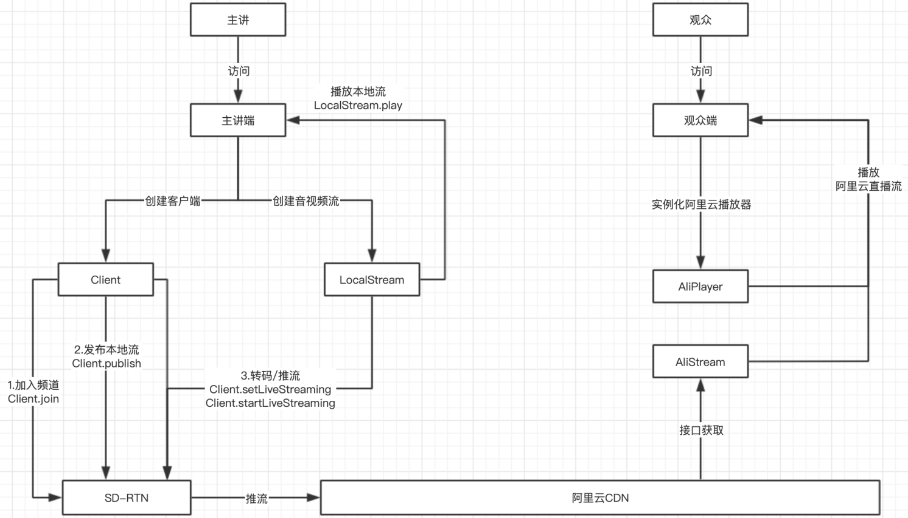
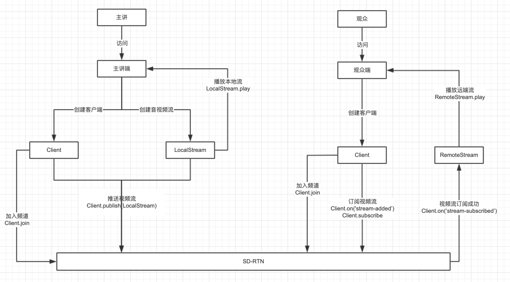
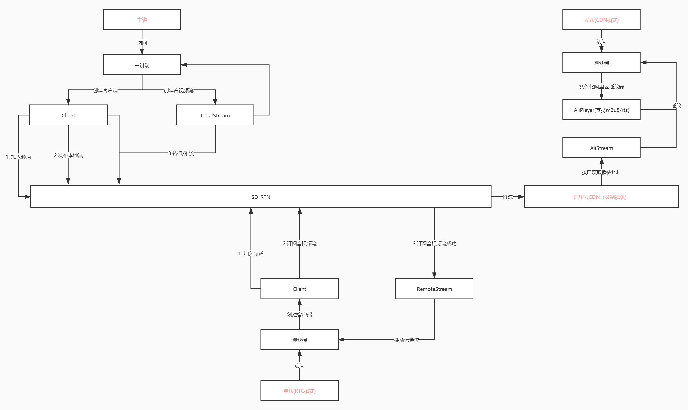
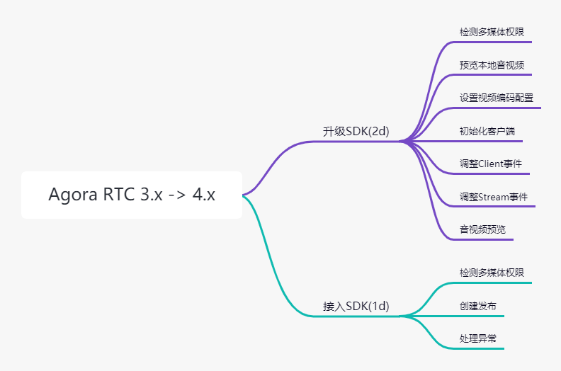
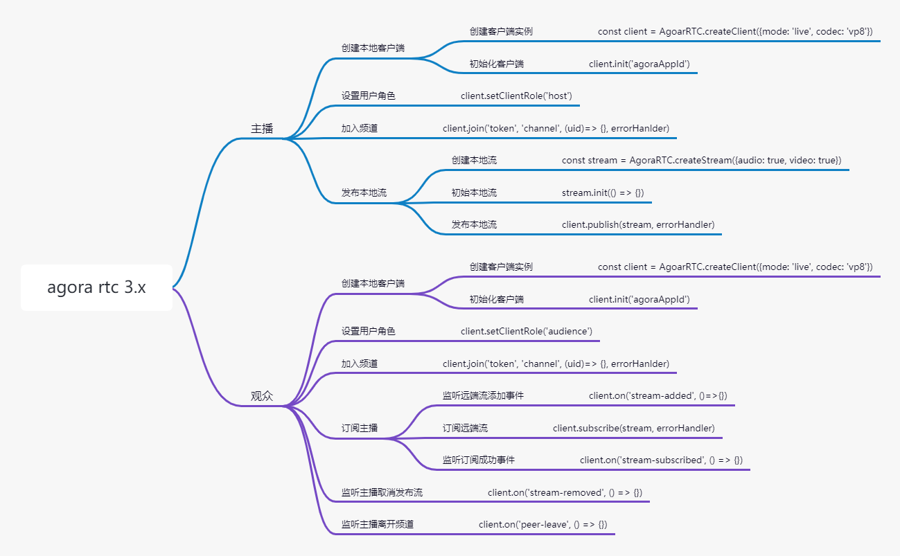
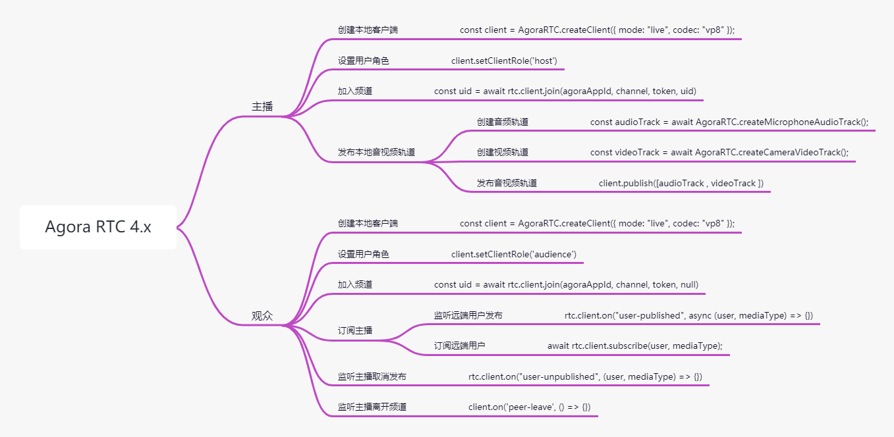

# 全链路Agora RTC

## 1 链路
## 1.1 现状

## 1.2 RTC

## 1.3 RTC+CDN

## 2 功能

### 2.1 要点
- 主播端
  - 现有推流方式基本不变
  - 保留推流到CDN方式，仍在阿里云上录制视频
- 观众端
  - 支持m3u8和rts：阿里云播放器2.9.x支持m3u8和rts
  - 支持频道内播放：接入Agora RTC。播放器是Agora内置，需确认是否支持使用第三方播放器

### 2.2 接入RTC
现有直播SDK基于`agora-rtc-sdk 3.x`，而`4.x`和`3.x`的版本差异很大。`4.x`功能有较大升级，设计更合理，使用更简洁。理论上升级到`4.0`，更有利于直播功能实现。

### 2.2.1 Agora RTC 3.x -> 4.x

### 2.2.2 接入Agora RTC 3.x

### 2.2.3 接入Agora RTC 4.x

## 3 功能要点
- 接入Agora RTC 3.x（3.5d）
  - 主播端
    - 摄像头开启关闭 0.5d
    - 处理异常场景 1d
  - 观众端
    - 实现订阅流程：1d
    - 处理异常场景：2d
- 接入Agora RTC 4.x (3.5d)
  - 主播端
    - 摄像头开启关闭 0.5d
    - 处理异常场景 1d
  - 观众端
    - 实现订阅流程：1d
    - 处理异常场景：2d
- 升级SDK：AgoraRTCSdk 3.0 -> 4.0 (3d)
- 拉通自测：(2d)