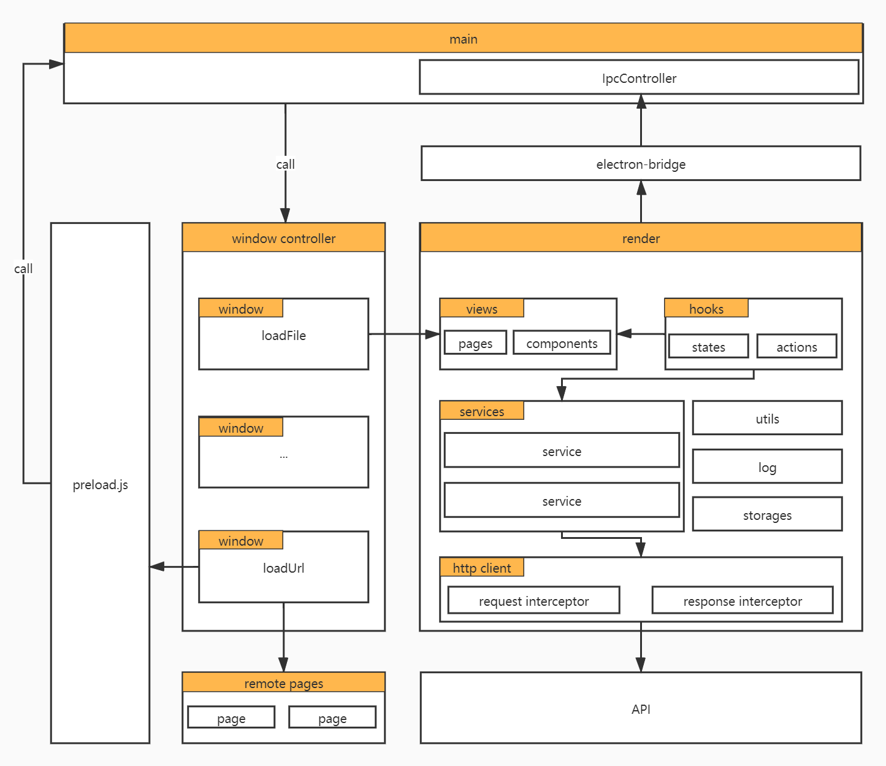
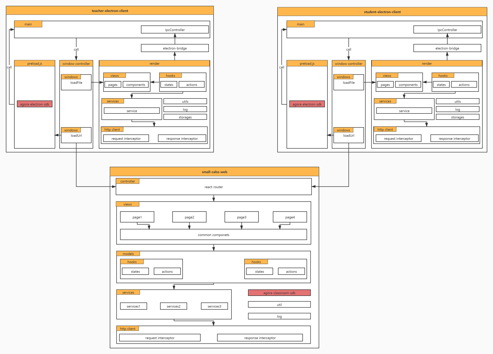
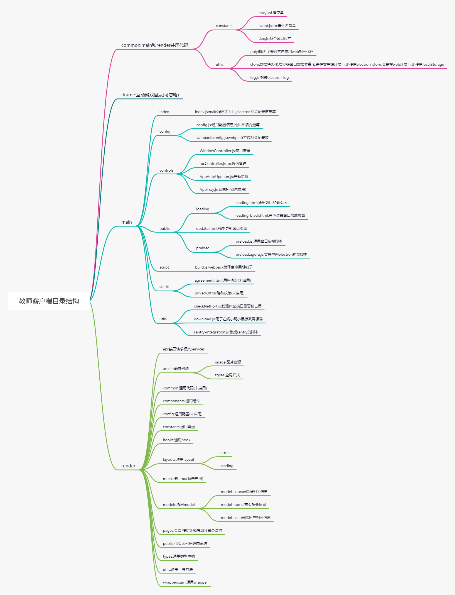
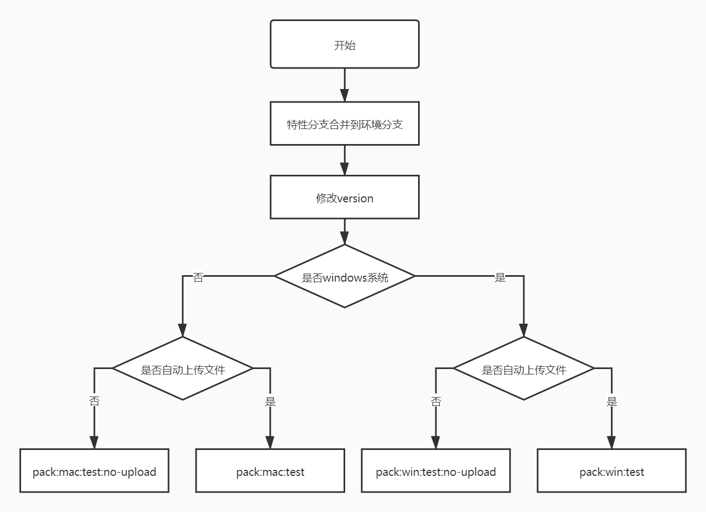
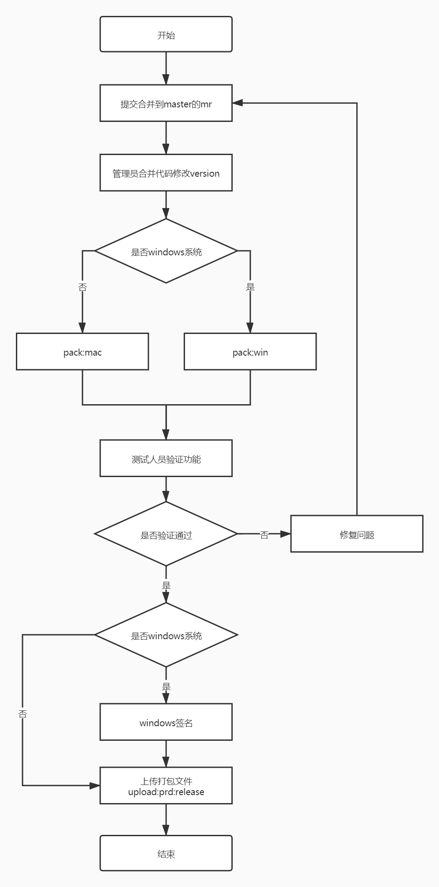

# 星火教育教师客户端

## 1 项目介绍
`星火教育教师客户端`初期定位为面向星火教育事业部老师上课使用的客户端应用，集成不同授课方式业务，比如面授小班、在线大班、在线小班、互动课堂等等。随着业务调整，该客户端将会作为集团教师授课入口，承接除了星火以外产品线业务，比如个性化。

## 2 技术体系
基于`Electron`客户端技术，兼容`Windows`和`Mac`。出于技术收敛考虑，将`Electron`和`Umi`进行整合，实现了客户端和`Web`技术栈统一：`Umi`+`React`+`React Hooks`。技术栈资料，可查阅：
- Electron
  - [Electron开发入门介绍](https://xiaojiaoyukeji.yuque.com/xiaojiaoxue/front/ggz7ra)
  - [Electron星火小学客户端开发](https://xiaojiaoyukeji.yuque.com/xiaojiaoxue/front/ngep2h)
  - [Electron班课客户端开发](https://xiaojiaoyukeji.yuque.com/xiaojiaoxue/front/ngep2h)
- Umi
  - [Umi官网](https://umijs.org/zh-CN)
- React
  - [React官网](https://zh-hans.reactjs.org/)
  - [函数式组件与类组件有何不同](https://overreacted.io/zh-hans/how-are-function-components-different-from-classes/)
  - [useEffect 完整指南](https://overreacted.io/zh-hans/a-complete-guide-to-useeffect/)
  - [React hook实践及组件规范](https://xiaojiaoyukeji.yuque.com/xiaojiaoxue/banke/ff43me)

## 3 架构设计
### 3.1 客户端架构

- 通过[WindowControllers](./src/main/controls/WindowController.js)管理多窗口生命周期：创建、显示、隐藏、销毁。
- `render`进程和`main`进程可以通过`ipc`或者`electron remote`进行通信，一般使用`ipc`。为了便于管理，`main`端统一在[IpcController](./src/main/controls/IpcController.js)，`render`端统一在[electron-bridge](./src/render/utils/electron-bridge.ts)。
- 所有窗口继承于窗口基类[BaseAppWindow](./src/main/controls/BaseAppWindow.js)。
- 窗口可通过两种方式加载页面
  - `loadFile`：加载本地页面，例子[XAppLoginWindow](./src/main/controls/XAppLoginWindow.js)。
  - `loadURL`：加载远程页面，例子[XAppOnlineSmallClassWindow](./src/main/controls/XAppOnlineSmallClassWindow.js)。
- 窗口加载远程页面场景下，若想和`main`进程通信，可通过挂靠在窗口上的[preload](./src/main/public/preload.js)暴露的全局对象进行。加载的本地页面一般不需要通过`preload`而是直接调用`ipc`或者`electron.remote`。
- 多窗口数据共享，一般通过[GlobalStore](./src/render/utils/store/index.ts)。

### 3.2 教师客户端、学生客户端和直播web关系

- [教师客户端](https://gitlab.xinghuolive.com/teaching-fe/teaching-banke-interaction-classroom)、[学生客户端](https://gitlab.xinghuolive.com/teaching-fe/banke-student-live-client)都是通过`loadUrl`方式进入直播页面。
- [直播web服务](https://gitlab.xinghuolive.com/teaching-fe/teaching-banke-online-small-class)承载了接入声网灵动课堂的功能，还会作为围绕在线小班附加功能，比如`学生直播web入口登陆页`、`唤起客户端应用中转页`等等。

## 4 目录结构
目录结构主要是区分`main`进程和`render`进程目录，`render`目录规范可参考：[班课项目迭代目录规范-umi篇](https://xiaojiaoyukeji.yuque.com/xiaojiaoxue/banke/caeg5t)

## 5 发包流程
### 5.1 基本规范
按境有`test`、`pre`、`master`分支。对应就是`测试版`、`预发布版`和`正式版`。必须遵循以下规范：
  - 修改`version`：确保已修改[package](./package.json)的`version`，关于`version`规范请查看[semver规范](https://semver.org/)。
  - 必须在对应环境分支上打包：确保已切换到对应环境分支上，比如打`测试版`必须在`test`分支上，打`预发布版`必须在`pre`分支上等等。切记不可在自己的特性分支上打包。
  - 打包命令区分环境和系统：比如打`windows`测试版，则运行`npm run pack:win:test`；若打`mac`测试版，则运行`npm run pack:mac:test`，依次类推。若只是想打包文件不上传到远端服务器上，则可以运行`npm run pack:win:test:not-upload`。

### 5.2 流程步骤
测试&预发布的打包流程和正式的不同：
- 测试&预发布版本：

- 正式版本：

