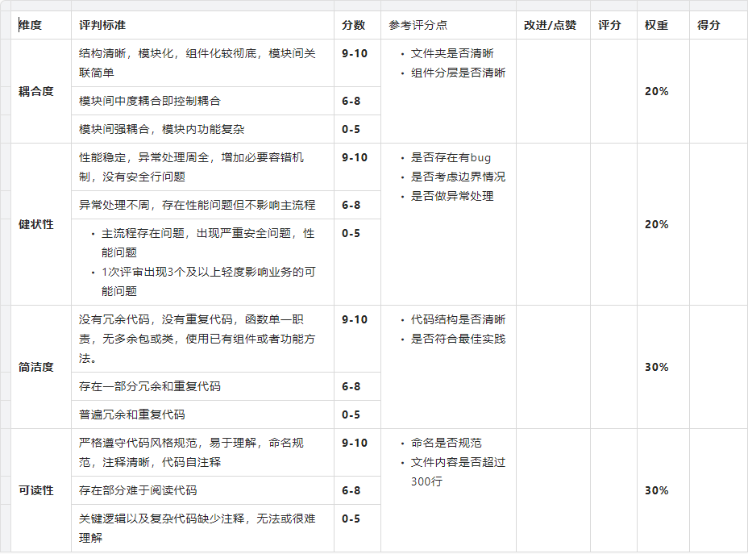
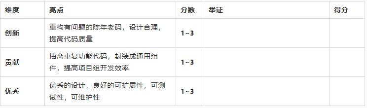

# Code Review评分标准

## 1 前言背景
好的代码，就如优秀文章，结构明了，逻辑清晰，言简意赅，语言技巧，随处可见。然而写得了好代码并非易事。俗话讲，习得一门语言可能只需21天(比如21天精通xx系列)，但习得良好编程习惯却要年积月累。

经验丰富程序员的优势不仅体现在处理问题能力上，还体现在编写代码风格质量上。良好的代码品味应该是有追求的程序员的基本素养。所谓`Code Review`，就是经验丰富的程序员对团队成员编写的代码进行评审。其最初目的是，帮助被评审者找出并修复错误，保证项目质量。在实际执行过程中，它还有如下优点：
- 保证代码质量：代码遵循代码规范，确保写法和逻辑严谨，让其他人能够快速理解和上手
- 发现潜在风险：自测可以发现部分问题，但不能保证覆盖所有场景。多一个人，就多双发现问题眼睛。被评审者在讲解实现思路时，可能会意识到漏洞。评审者也会从其他维度去思考，发现设计不足
- 互相学习提高：`Code Review`过程，也是高手传授知识过程，参与者可以学习前人经验教训，提高编码能力。所谓"前富"带动"后富"，最终实现整体水平提升，达到共同"富裕"

将`Code Review`做为研发流程重要一环，持续稳定地进行，不仅对项目质量有提高，而且对团队成员成长也大有裨益。故我们借鉴前人经验，结合项目实际，初步制定评分标准，来推动`Code Review`健康有序地执行。希望大家群策群力，多提想法和建议，一起把它做好。

## 2 自查项目
被评审者在发起`Code Review`请求前，需对设计和代码自查，提前发现基础问题并修复，减少评审者`Code Review`时间成本。建议自查项如下（若有疏漏，请继续补充）：
- 常规项
  - 程序是否能够运行，逻辑正确，实现预期功能需求?
  - 代码是否简洁易懂，是否模块化/组件化，是否存在重复代码片段，是否使用已有组件或工具方法，而不是重复造轮子?
  - 代码风格是否符合规范?
  - 是否清除注释掉的代码? 原则上删除,不删除请给出原因
  - 是否删除日志和调试代码?原则删删除, 提供`debug`选项来开启
  - 代码嵌套是否超过`3~4`层
  - 是否出现魔法值(魔鬼数字)
- 文档
  - 关键功能是否添加注释？数据结构是否进行必要解释?
  - 对非常规行为或边界情况处理是否添加描述?
  - 是否对其标识`TODO`或者移除
- 性能
  - 代码是否有明显影响性能的逻辑和计算
  - 页面加载时长是否超过`2~3`秒
  - 是否存在循环引用导致内存`泄漏代码
  - 程序运行时`CPU`以及内存是否居高不下，切换页面(场景)时是否会释放？
- 安全
  - 是否对用户输入进行类型检查？
  - 是否有防范`XSS`机制？
  - 是否有防范`CRSF`机制？
  - 导入第三方库是否存在安全问题或者开源许可证问题？

## 3 评分标准
### 3.1 基础评分

### 3.2 亮点加分
当然，我们倡导鼓励创新、贡献和优秀，如有以下亮点，评审者可酌情加分：

加分项得分直接加到基础总分上，即是：`总得分=基础总分+亮点加分总分`

## 4 评审结论
评审者需要在对应的维度列出不足以及点赞的地方，让被评审者扬长避短，而且也能让其他成员取长补短。评审完后，评审者需将结果发给被评审者，被评审者需整理发出评审会议纪要，并跟进问题修复。