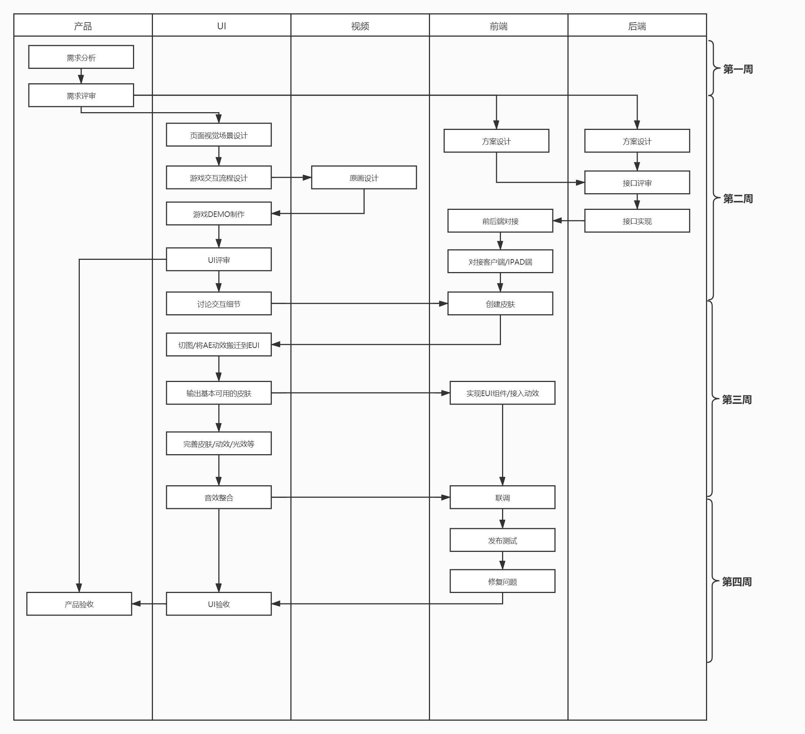
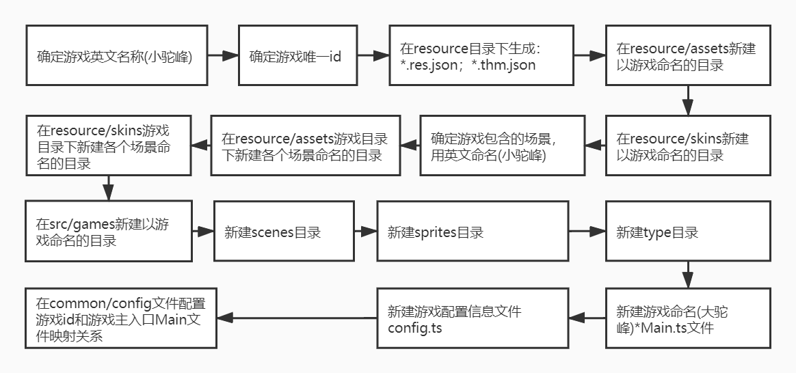

# games-platform

## 1 项目介绍

`games-platform`游戏平台项目，基于[Egret Engine](https://www.egret.com/)开发互动游戏。项目目标，将它打造独立于业务线存在游戏平台。

## 2 技术体系

基于`Egret Engine`开发，借助`Egret`提供的各种工具完成工作。`Egret`开发介绍，请查看[使用Egret开发游戏指南](./guide/develop_game_by_egret.md)。`Egret`工具使用介绍：

- [使用EUI Editor生成皮肤文件](https://xiaojiaoyukeji.yuque.com/xiaojiaoxue/ui/qnxvad)
- [使用Texture Merger生成纹理集](./guide/generate_sprite_sheet_guide.md)
- [使用Texture Merger生成Bitmap Font](https://xiaojiaoyukeji.yuque.com/xiaojiaoxue/ui/hvwhkf)
- [使用Res Depot管理资源文件](./guide/manage_resource_by_res_depot.md)

## 3 架构设计

`games-platform`是做为多个`游戏`承接平台，需保证各个`游戏`按需载入，独立运行。详细的项目架构介绍，请查看[games-platform项目架构设计](./project_architecture.md)

## 4 研发流程

游戏研发需要多个角色协同参与，角色各司其职，相互独立又相互依赖。经过前期两个迭代后，初步总结如下研发流程（其中：上方框代表角色，比如产品/UI/视频/前端/后端）

## 5 开发流程

开发一个新游戏，需要建各种目录以及文件，后续会提供命令行工具完成这些繁琐工作，前期先手动创建。比较快捷的方式，将已有的游戏目录文件拷贝出来，根据新游戏的情况进行删改。如下为大概开发流程图，详细请查看[games-platform游戏开发流程](./develop_game_step.md)

## 7 开发规范

本规范并非`Egret`官方指南，仅做为`games-platform`项目游戏开发实践指导建议。游戏开发对于项目成员都是陌生的，都是摸着石头过河，我们都一样。有些建议可能不是最佳，可能存在疏漏和误导。望大家能够及时反馈，一起完善。详细请查看[Egret游戏开发规范](./develop_game_by_egret_standard.md)

## 8 游戏测试

理论上，游戏独立于后台接口，只要提供游戏初始化数据，mock答题器信号，以及mock提交数据等接口，即可进行本地调试。基于这个目的，系统架构设计时，预留一些测试接口，可以接收本地传入的数据或mock方法，让游戏可独立于答题器以及后台接口而正常运行。详细文档请查阅[本地调试游戏方法](./guide/local_debug_game_guide.md)
## 9 版本总结

每次迭代上线后，需要将遇到问题以及经验总结输出文档，避免后续开发继续踩坑，希望各个开发将这个传统保持下去。以下是各迭代版本复盘文档：

- [v1.12.0](./project_post_mortem/v1.12.0.md)
