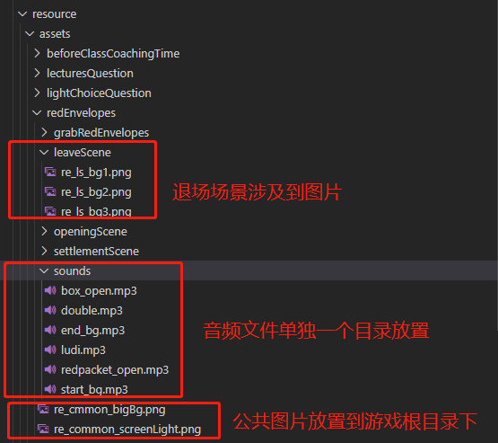
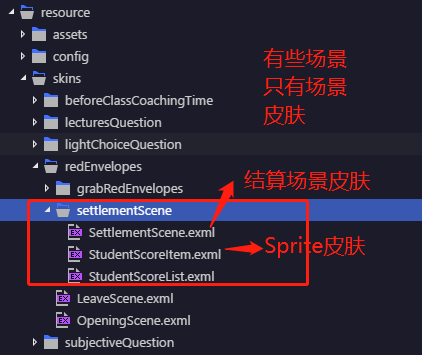
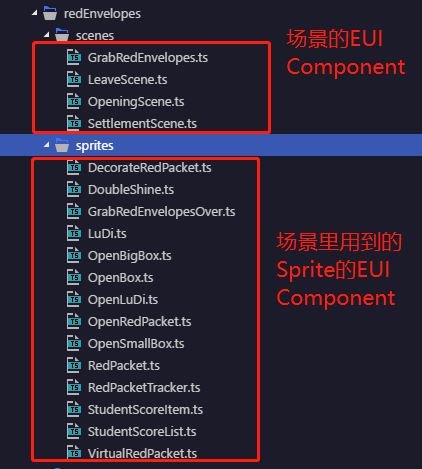

# 游戏开发流程


## 1 确定游戏英文命名

遵循小驼峰规则，使用英文命名新游戏。以`抢红包`为例，英文名称为`redEnvelopes`

## 2 确定游戏唯一id

- 优先跟后台保持一致。真实的游戏，比如`消消龙`、`抢红包`等，后台维护一套`id`规则，值从`1`开始，依次递增。所以`消消龙`为`1`，`抢红包`为`2`。
- 若不是真实的游戏，比如各种课中答题互动，后台是没提供`id`的。这时，需要前端确定一套非游戏的生成`id`的机制。确定是以`501`开始，依次递增。比如`课前辅导时间`为`501`，`主观题答题互动`为`502`，`轻选择题答题互动`为`503`，`课堂题答题互动`为`504`。

确定游戏唯一`id`后，将该值写到`common/config.ts`文件里：

```ts
module common {
  export class Config {
    public static redEnvelopes = 2; // 抢红包
    public static beforeClassCoachingTime = 501; // 课前辅导时间
    public static subjectiveQuestion = 502; // 主观题课中互动
    public static lightChoiceQuestion = 503; // 轻选择器课中互动
    public static lecturesQuestion = 504; // 课堂题课中互动
  }
}
```

## 3 创建资源配置文件

资源配置文件包含两种：
- 静态资源
- 主题(皮肤)

### 3.1 静态资源

以`抢红包`游戏为例，静态资源配置文件为`redEnvelopes.res.json`

```json
{
  "groups": [
    {
      "keys": "re_ls_bg1_png,re_ls_bg2_png,re_ls_bg3_png",
      "name": "red_envelopes_preload"
    }
  ],
  "resources": [
    {
      "url": "assets/redEnvelopes/re_common_screenLight.png",
      "type": "image",
      "name": "re_common_screenLight_png"
    },
    {
      "url": "assets/redEnvelopes/openingScene/openingScene_02.json",
      "type": "sheet",
      "name": "openingScene_02_json",
      "subkeys": "re_os_beam3_png,re_os_beam5_png"
    },
    {
      "url": "assets/redEnvelopes/sounds/double.mp3",
      "type": "sound",
      "name": "double_mp3"
    }
  ]
}
```
- `groups`：定义资源`分组`集合。为了便于资源加载，将相关联的资源划分为`组`
- `resources`：定义资源的`name(名称)`、`type(类型)`和`url(路径)`，在程序一般是通过`name(名称)`获取资源

若直接在`json`为何资源，会很繁琐而且容易出错，好在`Egret`提供`Res Depot`管理资源工具，`Egret Wing`以及`Egret UI Editor`也内置提供资源管理工具。如何使用工具管理资源，详情请查阅[使用Res Depot管理资源](./guide/manage_resource_by_res_depot.md)

### 3.2 主题(皮肤)文件

以`抢红包`游戏为例，皮肤配置文件为`redEnvelopes.thm.json`

```json
{
	"skins": {
		"redEnvelopes.DecorateRedPacket": "resource/skins/redEnvelopes/grabRedEnvelopes/DecorateRedPacket.exml"
	},
	"autoGenerateExmlsList": false,
	"exmls": [
		"resource/skins/redEnvelopes/grabRedEnvelopes/DecorateRedPacket.exml"
	],
	"path": "resource/redEnvelopes.thm.json"
}
```
- `skins`：定义`EUI Component`和`EXML`绑定关系，若不清楚`EUI Component`和`EXML`之间的关系，可查看[课中互动开发-白鹭引擎（开发篇）之EUI](./guide/develop_game_by_egret.md#4)
- `autoGenerateExmlsList`：是否让程序自动生成`exmls`列表，注意若设置为`true`，则程序打包或运行时，将把`skins`目录下所有`exml`类型文件生成到`exmls`字段下，而且会覆盖掉手动填写进去的。建议不要开启。
- `exmls`：定义该游戏`抢红包`所有的皮肤文件路径
- `path`：定义主题配置文件存放路径

### 4 划分游戏场景

游戏会有多个场景组成。划分场景，利于资源和代码维护。一般游戏会有如下场景：

- 开场场景：`openingScene`
- 转场场景：`transitionScene`
- 结算场景：`settlementScene`
- 离场场景：`leaveScene`

其他场景按游戏不同去划分，比如`抢红包`游戏，中间就包含了，抢红包场景：`grabRedEnvelopes`。
### 5 合理创建目录

通过上述游戏命名，场景划分以及命名后，游戏基本框架就有了。后面就需要合理组织目录。游戏文件会涉及如下类型文件：

- 静态资源：图片、音频、视频
- 皮肤资源
- 代码资源

#### 5.1 静态资源目录

以`抢红包`为例，将不同场景需要用到的图片放置到对应的场景命名目录下，音频文件单独一个目录放置。



#### 5.2 皮肤文件目录

以`抢红包`为例，按不同场景划分生成各个场景皮肤文件，一般场景里会包含各种元素，这些元素，我们称之为`Sprite`。其实每个`Sprite`就是一个个`EUI Component`，因此也对应会有`exml`皮肤文件。这些`Sprite`应该随`场景`皮肤一起放置。



#### 5.3 代码文件目录

以`抢红包`为例，按不同场景生成各个场景`EUI Component`类文件，放置到`scenes`目录下。场景使用到`Sprite`统一放置在`sprites`目录下。



### 6 添加配置信息

完成上述步骤后，游戏的主框架基本成型。接着，就需要在`common/config.ts`添加必要配置信息，才能让程序的主入口`Main`加载该游戏。

#### 6.1 配置游戏ID和游戏主入口类关系

```ts
module common {
  export class Config {
    public static redEnvelopes = 2; // 抢红包

    public static gameNameToGameClassMap = {
      [Config.redEnvelopes]: redEnvelopes.RedEnvelopeGameMain// 抢红包主入口
    }
  }
}
```
#### 6.2 配置游戏ID和游戏资源关系

```ts
module common {
  export class Config {
    public static redEnvelopes = 2; // 抢红包

    public static gameNameToResourceMap = {
      [Config.redEnvelopes]: {
        preload: 'red_envelopes_preload',
        res: 'resource/redEnvelopes.res.json',
        thm: 'resource/redEnvelopes.thm.json',
        sounds: [
          'double_mp3',
          'ludi_mp3',
          'redpacket_open_mp3',
          'box_open_mp3',
          'end_bg_mp3',
          'start_bg_mp3'
        ]
      }// 抢红包游戏
    }
  }
}
```

### 7 结束

接下来，就靠大家去完成游戏具体功能，祝玩得愉快。