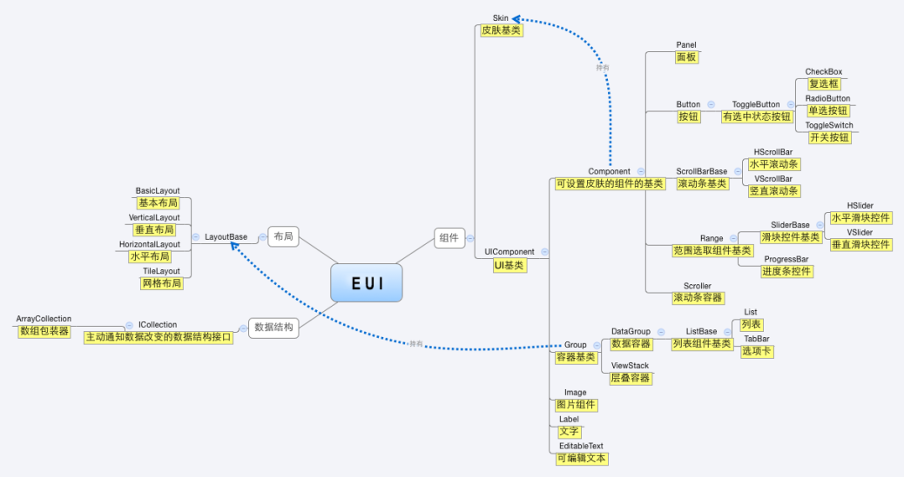

# 课中互动开发-白鹭引擎（开发篇）
## 1 前言
`Egret Engine`是一款使用`TypeScript`编写的`HTML5`游戏引擎，包含渲染，声音，交互，资源管理等功能，支持`2D`和`3D`，支持`Canvas`和`WebGL`，拥有完善的跨平台运行能力。

围绕`Egret Engine`建立一套研发`HTML5`游戏生态，不只是游戏引擎，也提供开发工具比如`Egret UI Editor`，`Egret Wing`，`DragonBones`，`Texture Merger`等
- [Egret官网](https://www.egret.com/)
- [Egret开发手册](https://docs.egret.com/engine/docs/installation/installation)

## 2 开发环境
- 安装[Node](https://nodejs.org/en/)，建议安装稳定版
- 安装[Git](http://npm.taobao.org/mirrors/git-for-windows/)
- 安装[Egret Launcher](https://docs.egret.com/engine)
- 安装成功后，打开`Egret Launcher`，进入主界面
- 安装引擎：选择`引擎`页签，在引擎列表中选择需要的版本。项目所用的`引擎`是必选，不然无法启动项目。游戏平台用的版本号为`5.2.33`
- 安装工具：选择`工具`页签，分别下载安装`Egret Wing`，`Egret UI Editor`。这两个工具用的比较多，其他工具在需要的时候再安装。其中`Egret Wing`是游戏项目的编辑器，基于`VSCode`扩展；`Egret UI Editor`是皮肤文件(`skin`)编辑器
- 导入项目：选择`项目`页签，点击`导入项目`按钮，导入对应游戏项目。操作成功后将在项目列表中显示

`Egret Launcher`是`Egret`游戏生态系统的管理平台，开发者可以在此快捷简单查找安装相关工具，创建编译发布项目。

## 3 术语
### 3.1 `stage`(舞台)
舞台是显示游戏元素的平台，在游戏视觉编程里，一切游戏的元素必须添加到舞台才能被显示。因此，舞台也是放置显示对象的最终容器。注意一个游戏只有一个舞台。
### 3.2 `scene`(场景)
场景是我们在游戏中所看到的物品、建筑、人物、背景、声音、特效等，基本上和我们玩游戏时所看到的游戏“场景”是同一个概念。类比歌剧，剧情分幕。
### 3.3 显示对象
`显示对象`，是可以在舞台上显示的对象。可以显示的对象，既包括可以直接看见的图形、文字、视频、图片等，也包括不能看见但真实存在的显示对象容器。在Egret中，视觉图形都是由显示对象和显示对象容器组成的。
`DisplayObject`类是所有显示对象的父类，该类包含显示对象共有的属性与方法。
### 3.4 显示容器
一种是可以包括其他显示对象的显示对象容器。


### 3.5 层级
`z-index`属性的效果
### 3.6 坐标系
`舞台`、`显示容器`、`显示对象`等坐标原点，默认左上角，可以通过设置对象的`anchorOffsetX`/`anchorOffsetY`属性修改坐标原点。对象是相对于它的直接父级容器定位的。


### 3.7 帧
影像动画中最小单位的单幅影像画面，相当于电影胶片上的每一格镜头。 一帧就是一副静止的画面，连续的帧就形成动画。
### 3.8 动画
- 帧动画：是一种在连续的关键帧中分解动画动作，即在时间轴的每一帧上绘制不同内容并使之连续播放成动画的一种常见的动画形式


- 缓动动画：自然界中没有东西是从一点呈线性地移动到另一点。现实中，物体在移动时往往会加速或减速。我们的大脑习惯于期待这种运动，因此在做动画时，应利用此规律。自然的运动会让用户对您的应用感觉更舒适，从而产生更好的总体体验


- 骨骼动画：模拟骨骼运动的机制而制作的动画，走、跑、跳是由骨骼带动躯干和四肢完成的


### 3.9 粒子效果
粒子效果表示三维计算机图形学中模拟一些特定的模糊现象的技术，而这些现象用其它传统的渲染技术难以实现的真实感的游戏图形。经常使用粒子系统模拟的现象有火、爆炸、烟、水流、火花、落叶、云、雾、雪、尘、流星尾迹或者象发光轨迹这样的抽象视觉效果等等

- 箭雨粒子特效


- 爆炸粒子特效


- 刚体破碎特效


## 4 EUI
`EUI`是一套基于`Egret`核心显示列表的`UI`扩展库，它封装了大量的常用`UI`组件，能够满足大部分的交互界面需求，也可以基于`EUI`已有组件进行组合或扩展，以实现复杂交互需求。`EUI`里可以使用`EXML`来开发应用界面，标签式的语法更加适合`UI`开发，`EXML`开发可以做到`UI`与逻辑代码的分离。


### 4.1 传统组件
实例化一个容器，在容器初始化时添加各种素材，分别设置样式布局，然后增加事件监听处理逻辑。动态的逻辑和静态的布局以及样式耦合在一个类里。
```
module game {
    export class ScoreTip extends egret.DisplayObjectContainer {

        private position: any;

        private stuName: string;

        private point: number;

        public constructor(stuName: string, point: number, position?: any) {
            super();
            this.position = position;
            this.stuName = stuName;
            this.point = point;
            this.addEventListener(egret.Event.ADDED_TO_STAGE, this.createScore, this)
        }

        private createScore() {
            const container: egret.DisplayObjectContainer = new egret.DisplayObjectContainer();
            this.addChild(container);
            const bg = game.Utils.createBitmapByName("score_tip_bg_png");
            container.addChild(bg);
            const nameText: egret.TextField = new egret.TextField();
            container.addChild(nameText);
            nameText.textColor = 0xffffff;
            nameText.size = 24;
            nameText.bold = true;
            nameText.text = this.stuName;
            nameText.x = 50;
            nameText.y = 57;
            nameText.strokeColor = 0xba6b04;
            nameText.stroke = 2;
            const scoreText: egret.TextField = new egret.TextField();
            container.addChild(scoreText);
            scoreText.textColor = 0xfffa6a;
            scoreText.size = 24;
            scoreText.bold = true;
            scoreText.text = `+ ${this.point}`;
            scoreText.x = 130;
            scoreText.y = 57;
            scoreText.strokeColor = 0xba6b04;
            scoreText.stroke = 2;
            if(this.position) {
                container.x = this.position.x - container.width/4;
                container.y = this.position.y;
            }
            console.log(container.width,container.height)
            // container.anchorOffsetX = c;
            container.anchorOffsetY = container.height/2;
            if(this.position) {
                setTimeout(()=>{
                    egret.Tween.get( container ).to( {y: container.y - 100, alpha: 0 }, 1000);
                },400)
            }
        }

    }
}
```
### 4.2 皮肤分离
把样式从逻辑中解耦出来，用一个逻辑组件外加一个皮肤对象的方式去实现原来单个组件的功能。逻辑组件里只负责动态的逻辑控制代码，如事件监听和数据刷新。皮肤里只负责外观，如实例化子项，初始化样式和布局等静态的属性。


### 4.3 EXML
`EXML`是一种严格遵循XML语法的标记语言，用于描述静态UI界面，也可以实现动画效果。使用`EXML`定义`EUI`组件的`皮肤`。
### 4.4 EUI组件
继承`eui.Component`，实现`eui.UIComponent`接口的组件。`EUI`组件负责实现数据以及事件管理。
### 4.5 EUI组件类和EXML绑定
#### 4.5.1 主题文件设置
在对应的主题文件`x.thm.json`文件里，设置相关信息：

`redEnvelopes.thm.json`
```
{
  "skins": {
    "redEnvelopes.DecorateRedPacket": "resource/skins/redEnvelopes/DecorateRedPacket.exml"
  },
  "exmls": [
    "resource/skins/redEnvelopes/DecorateRedPacket.exml"
  ]
}
```
#### 4.5.2 初始化设置
`DecorateRedPacket.ts`
```
public constructor () {
  super();
  this.skinName = "resource/skins/redEnvelopes/DecorateRedPacket.exml";
}
```
#### 4.5.3 组件类元素和EXML元素映射
在`EXML`文件中声明的元素，只需在`EUI`组件类声明于该元素`id`同名的属性，即可在组件类中访问。
- EXML声明元素（`DecorateRedPacket.exml`）
```
<?xml version="1.0" encoding="utf-8"?>
<e:Skin class="DecorateRedPacket" width="1720" height="1040" xmlns:e="http://ns.egret.com/eui" xmlns:w="http://ns.egret.com/wing" xmlns:tween="egret.tween.*">
  <tween:TweenGroup id="decorateRedPacket"></tween:TweenGroup>
  <e:BitmapLabel id="countDown" width="69" height="54" x="851" y="54" anchorOffsetX="0" anchorOffsetY="0" font="daojishi_fnt" text="03"/>
</e:Skin>
```
- 组件类声明属性(`DecorateRedPacket.ts`)
```
private countDown: eui.BitmapLabel;
private decorateRedPacket: egret.tween.TweenGroup;
```
- 在组件类`childrenCreated`函数里访问`EXML`里的元素
```
protected childrenCreated():void {
  super.childrenCreated();
  this.countDown.text = this.formatCountDown(this.timerRepeatCount);
  this.decorateRedPacket.play(0);
  this.decorateRedPacket.addEventListener('complete', this.onDecorateRedPacketTween, this);
}
```
- 本质上`EXML`是`EUI`组件的语法糖，`Egret compiler`会将`EXML`代码转换到`EUI`组件类中。所以在`EUI`组件类中声明属性时，需要特别注意，类属性和元素`id`映射关系，避免命名冲突，如果存在冲突，则皮肤的`id`指向的元素会覆盖类的属性
### 4.6 编辑器
#### 4.6.1 官方编辑器
`UI`设计师和前端开发利用以下编辑器，实现并行工作，提升开发效率。
- `EUI Editor`：提供可视化编辑皮肤文件，设计师不需学习`EXML`复杂繁琐的语法，只需在`EUI Editor`下编辑`EXML`即可完成`EUI`组件界面设计
- `Egret Wing`：提供给前端开发使用，内置有创建`EXML`、`EUI`组件等模板，并且提供维护`resources`可视化界面
#### 4.6.2 `Egret Wing`停更
`Egret Wing`基于`VSCode`扩展实现的，而`VSCode`迭代相对频繁，若`Egret Wing`跟随`VSCode`版本升级，会导致内置功能失效，维护升级成本较高，官方已停更，推荐直接使用`VSCode`，安装相关扩展。
- [使用VSCode开发Egret游戏](https://www.bilibili.com/video/BV1fZ4y1x7MR/)
- [VSCode插件安装](https://docs.egret.com/engine/docs/installation/installation-plugin)
## 5 调试
### 5.1 启动
`Egret Wing`编辑器`终端`运行`egret run -a`，启动`watch`模式，文件变更后，回自动编译运行。
### 5.2 工具
`Egret`游戏是`Canvas`实现的，在`Chrome`下是无法直接对游戏元素进行修改，推荐使用官方推出的调试工具`Egret Inspector`。

## 6 资源
### 6.1 博客
- [设计Bitmap Font](https://www.cnblogs.com/gamedaybyday/p/7674441.html)
- [白鹭引擎(Egret)中锚点(anchoroffset)的位置体会](https://www.jianshu.com/p/8161f37c255a)
- [音频播放](https://developer.egret.com/cn/article/index/id/126)
### 6.2 视频资源
- [H5.EGRET小程序.小游戏开发教程1期](https://www.bilibili.com/video/BV1Ct411q7ms?from=search&seid=13360178551227115241&rt=V%2FymTlOu4ow%2Fy4xxNWPUZ6cR9y0M1jztBnetbO0T3Bg%3D)
- [官方视频](https://docs.egret.com/engine/videoplayback)
### 6.3 社区
- [官方社区](https://bbs.egret.com/portal.php)
### 6.4 项目实战
- [基于Egret开发的射击类游戏](https://github.com/hedongshu/fire-in-the-hole)
- [Egret白鹭写的红包雨](https://github.com/chiefLit/egret-redPacketRain.git)
- [从零开始使用Egret开发一个贪吃蛇](https://mingyus.com/?p=189)
### 6.5 游戏框架
#### 6.5.1 CreateJS
- [官网](https://www.createjs.com/)
- [博客文章](https://zhuanlan.zhihu.com/p/40799542)
#### 6.5.2 PixiJS
- [官网](https://www.pixijs.com/)
- [博客文章](https://segmentfault.com/a/1190000017150623)