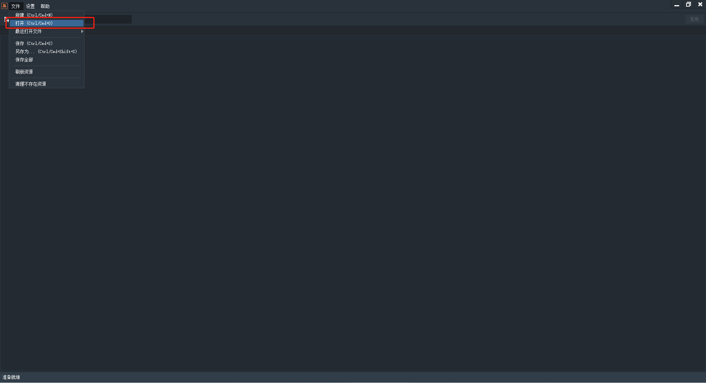

# 使用Res Depot管理资源

`Res Depot`是`Egret`官方推出，管理资源文件的工具。它提供如下功能：

- 资源可视化管理
- 可预览图片
- 可播放音、视频
- 可检测到存在问题资源
- 提供一键清除不存在的资源
- 提供创建资源分组

借助它，可方便快捷管理资源文件，提高游戏开发效率。

## 1 打开软件

## 2 打开资源配置文件

## 2 添加资源到配置文件

- 拖拽文件到列表中

- 添加资源文件成功

- 添加资源文件失败，在列表中以及状态栏左下角又红色提醒。当保存配置文件时，会提醒无法保存，需要将错误信息处理后才能保存。

## 3 资源分组

- 创建分组
  

- 从资源列表选择需要添加到分组文件，拖拽到分组的资源列表区

- 添加资源到分组成功，将会在分组的资源列表区显示

