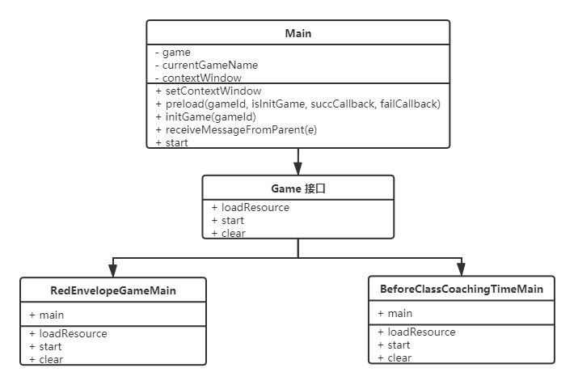

# 项目架构设计

## 1 项目目录
```
├─src
|  ├─types
|  |   ├─common
|  ├─games
|  |   ├─redEnvelopes
|  |   |      ├─config.ts
|  |   |      ├─RedEnvelopeGameMain.ts
|  |   |      ├─type
|  |   |      ├─sprites
|  |   |      ├─scenes
|  ├─common
|  |   ├─config.ts
|  |   ├─CustomerEvent.ts
|  |   ├─EventManager.ts
|  |   ├─Game.ts
|  |   ├─PostMessageEventType.ts
|  |   └Utils.ts
├─resource
|    ├─skins
|    |   ├─redEnvelopes
|    ├─assets
|    |   ├─redEnvelopes
|    |   |      ├─sounds
|    |   |      ├─settlementScene
|    |   |      ├─openingScene
|    |   |      ├─leaveScene
|    |   |      ├─grabRedEnvelopes
```
`egret-games-platform`作为白鹭游戏平台项目，承载课中互动和游戏，代码资源等将越来越多。为了后续维护管理，制定目录规范。基本原则是：游戏模块化，按游戏命名目录，将文件放到对应目录上。下面以`抢红包游戏`(`redEnvelopes`)为例。
### 1.1 `src`目录
放置代码文件
- `types`：项目公用类型声明文件
- `games`：互动游戏逻辑代码。
  - `redEnvelopes`：抢红包游戏相关代码
    - `type`: 类型声明文件
    - `scenes`：场景代码
    - `sprites`：场景中用到对象
    - `config.ts`：配置信息
    - `RedEnvelopeGameMain.ts`：抢红包游戏主入口
- `common`：项目公用配置，对象，接口，工具方法
  - `config.ts`：公用配置
  - `CustomerEvent.ts`：公用自定义事件对象
  - `EventManager.ts`：公用事件管理
  - `Game.ts`：定义各个互动游戏主入口的接口
  - `Utils.ts`：公共工具方法
### 1.2 `resource`目录
放置`图片`，`音频`，`皮肤`，`BitMap Font`等资源文件
- `skins`：放置`皮肤`文件
  - 皮肤文件只能放置在`skins`，其他地方则`EUI Editor`无法识别到皮肤文件
  - 按游戏创建目录，比如抢红包游戏，则新建`redEnvelopes`目录
  - 然后按照游戏场景划分，再创建四个目录：`openingScene`(开场场景)、`grabRedEnvelopes`(抢红包场景)、`settlementScene`(结算场景)和`openingScene`(离场场景)
- `assets`：放置`图片`，`音频`等资源
  - 按游戏创建目录，比如抢红包游戏，则新建`redEnvelopes`目录
  - 然后按照游戏场景划分，再创建四个目录：`openingScene`(开场场景)、`grabRedEnvelopes`(抢红包场景)、`settlementScene`(结算场景)和`openingScene`(离场场景)
  - 若资源是公共的，则直接放置到`redEnvelopes`目录下即可
  - 资源名称必须唯一，所以需要按照游戏名称，游戏场景做为名称前缀。比如抢红包游戏的开场场景下的背景图片：`re_os_main_bg`：其中`re`为游戏名称`redEnvelopes`的缩写；其中`os`为开场场景`openingScene`的缩写；后面的就是资源实际的名称。若是公共资源：`re_common_red_bag_bg`：其中`re`为游戏名称`redEnvelopes`的缩写；其中`common`为公共的意思；后面就是资源的实际名称
  - 资源名称只能是数字，大小写英文，下划线，不能包含空格，中文
## 2 设计思路
### 2.1 背景
`games-platform`是一个游戏平台项目，包含有多个游戏，架构上需实现如下功能：
- 按需运行
- 通信机制
- 事件管理
### 2.2 按需运行
- 模块化：实现各个游戏解耦，确保独立性
  - 按游戏创建目录
  - 按游戏创建`module`：比如抢红包模块`redEnvelopes`，创建公共模块`common`等
- 策略模式：实现按需预加载资源/初始化/启动游戏等
  - `Main`：项目主入口
  - `Game`：定义游戏的接口，具体游戏主入口实现该接口
  - `gameId`：标识游戏的唯一id，比如`消消龙`的gameId为`1`；`抢红包`的gameId为`2`；`课前辅导`的gameId为`501`等
  - 映射关系：`gameId`和`Game`接口实现游戏主入口类间的映射
  - `Main`根据传入`gameId`初始化对应游戏，执行相关逻辑

  
### 2.3 通信机制
其他端通过`iframe`接入`games-platform`。`games-platform`支持两种通信方式：
- `postMessage`：建议的方式。在录播客户端使用`postMessage`时，导致日志报错，弃用该方式。
- `contentWindow`：有跨域限制。`接入端`通过`iframe`的`contentWindow`访问`games-platform`的执行环境对象`window`，调用`games-platform`的方法；`games-platform`通过暴露`setContextWindow`拿到`接入端`的执行环境对象`window`。
### 2.3.1 隔离
为了确保`games-platform`的独立性，原则上不处理业务逻辑，不调用后台接口，仅提供互动游戏窗口，向外暴露通信接口。游戏的初始数据由`接入端`传入，游戏的结算数据由`接入端`提交。实现`端`与`端`解耦，无缝对接到其他`业务线`
### 2.3.2 协议
```
{
  namespace: 'string',
  type: 'string',
  data: 'object'
}
```
字段|类型|必选|描述|例
-|-|-|-|-|
namespace|string|是|消息来源|`"from-games-platform"`、`"to-games-platform"`
type|string|是|消息类型|`"init-config"`、`"enter-machine"`、`"enter-settlement"`、`"game-over"`、`"submit-score"`、`"change-crystal"`
data|object|否|消息数据|-
### 2.3.3 类型
type|namespace|data|描述
-|-|-|-
`"init-config"`|`"to-games-platform"`|-|`接入端`传入游戏配置信息
`"enter-machine"`|`"to-games-platform"`|`{"machine": {"uid": ""}, "student": {"studentId":"", "studentName": "", "machineId": ""}}`|`接入端`传入答题器数据
`"enter-settlement"`|`"to-games-platform"`|-|`接入端`发起游戏结算指令
`"game-over"`|`"from-games-platform"`|-|`games-platform`向`接入端`发送游戏结束消息
`"submit-score"`|`"from-games-platform"`|-|`games-platform`向`接入端`发送提交灵晶数据
`"change-crystal"`|`"from-games-platform"`|-|`games-platform`向`接入端`发送修改灵晶数据
### 2.3.4 方法
- `games-platform`暴露的全局方法：
  - `setContextWindow(contextWindow)`：设置`接入端`的执行环境对象`window`。为了能够在`games-platform`调用`接入端`的方法，实现通信
  - `preload(gameId, isInitGame, successCallback, failCallback)`：预加载游戏资源（`图片`、`音频`等）
  - `initGame(gameId)`：初始化游戏
  - `receiveMessageFromParent(e)`：`接入端`向`games-platform`通信的方法，[入参格式](#232-协议)
  - `start()`：启动游戏
- `接入端`暴露的全局方法：
  - `receiveMessageFromGame(e)`：`games-platform`向`接入端`通信的方法，[入参格式](#232-协议)。返回值为`Promise`，因为`接入端`接收到`games-platform`消息后可能执行异步操作，返回`Promise`给`games-platform`较好处理方式
- `接入端`向`games-platform`注入全局方法：（可选）
  - `loadedFromGame`：`接入端`可通过向`iframe`的`contentWindow`向`games-platform`注入该方法，以实现监听`games-platform`加载完`脚本文件`后执行回调的效果。该方法可确保`games-platform`的`Egret`运行环境已加载完成后，安全执行`preload`等方法。
### 2.4 事件管理
#### 2.4.1 内置事件处理
`Egret`内置实现一套业内标准的事件处理架构，主要包括三个对象：
- `Event`：事件对象，必须是`egret.Event`及其子类，包含`类型`、`数据`等信息
- `Event dispatcher`：分发者，事件发送方
- `Event listener`：监听者，事件接收方

`Egert`对象基本继承事件方法，有较完善的内置事件类型，详细内容查阅[事件处理机制](http://developer.egret.com/cn/github/egret-docs/Engine2D/event/principle/index.html)
#### 2.4.2 自定义事件
`Egret`内置事件类型无法满足需求时，可基于`egret.Event`扩展实现自定义事件类`CustomerEvent`，可灵活声明自定义的事件类型。
#### 2.4.3 全局事件管理
为了方便数据全局传递，基于`egret.EventDispatcher`扩展实现事件管理类`EventManager`。使用单例模式，全局共享一个事件管理对象，实现`Event Bus`。