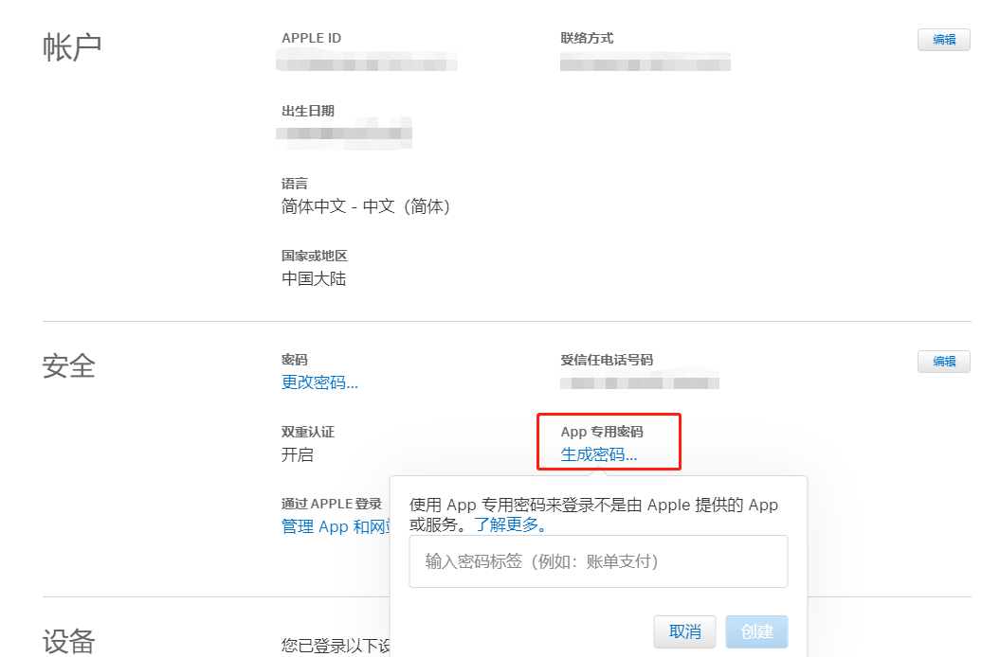
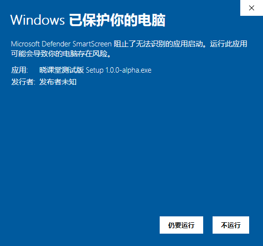
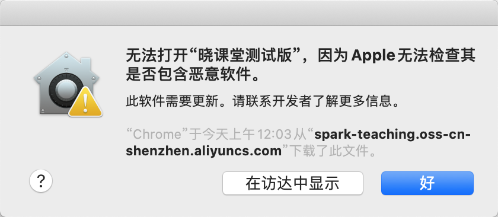

# 基于electron-build打包Electron项目

## 1. 技术选型
[electron-builder](https://www.electron.build/)为我们提供了一套完整的可配置化的解决方案，从开发、编译打包，到部署、自动更新，都提供了相应的模块，其`Github Star`数`10k`更是比官方推荐的`electron-forge`的`4k`足足高了`6k`。`electron-builder`使用起来更加省心，而且官方文档写的更加详细易懂，所以选择 `electron-builder`作为基本开发框架。

### 1.1 安装
```json
$ yarn add electron-builder --dev
```
### 1.2 配置
```json
{
  "build": {
    "appId": "com.spark.PYClassroom"
  }
}
```
## 2 本地开发
`electron-builder`为我们提供了`electron-webpack`模块，让我们可以在`electron`中找到熟悉的`web`开发感觉；同时其并内置了对`Vue`、`React`流行框架以及`TS`的支持，通过`packageJSON.electronWebpack`进行自定义配置：

```json
{
  "scripts": {
    "dev:test": "cross-env ELECTRON_WEBPACK_APP_ENV=-test electron-webpack dev",
    "dev:pre": "cross-env ELECTRON_WEBPACK_APP_ENV=-pre electron-webpack dev",
    "dev:prd": "cross-env ELECTRON_WEBPACK_APP_ENV= electron-webpack dev",
  },
  "electronWebpack": {
    "renderer": {
      "webpackConfig": "custom.webpack.additions.js"
    }
  },
}
```
设置自定义环境变量 ELECTRON_WEBPACK_APP_ENV 在本地调试不同的环境。

### 2.1 目录结构
`electron-webpack`有默认的目录结构规范：
```json
my-project/
├─ src/
│  ├─ main/
│  │  └─ index.js
│  ├─ renderer/
│  │  └─ index.js
│  └─ common/
└─ static/
```
我们只需要按照规范去编写放置文件即可。

#### 2.1.1 编译打包
```json
{
  "script": {
    "compile:test": "cross-env ELECTRON_WEBPACK_APP_ENV=-test electron-webpack",
    "compile:pre": "cross-env ELECTRON_WEBPACK_APP_ENV=-pre electron-webpack",
    "compile:prd": "cross-env ELECTRON_WEBPACK_APP_ENV= electron-webpack",
    "dist:test": "rimraf dist && yarn compile:test && cross-env ELECTRON_BUILDER_APP_ENV=test electron-builder -c.productName=晓课堂测试版 -mw",
    "dist:pre": "rimraf dist && yarn compile:pre && cross-env ELECTRON_BUILDER_APP_ENV=pre electron-builder -c.productName=晓课堂预发布版 -mw",
    "dist:prd": "rimraf dist && yarn compile:prd && cross-env ELECTRON_BUILDER_APP_ENV=prd electron-builder -c.productName=晓课堂 -mw"
  }
}
```
- `rimraf dist`：清空`dist`文件
- `yarn compile:env`，使用`electron-webpack`根据不同环境进行编译
- 设置`ELECTRON_BUILDER_APP_ENV`环境变量用于在后续部署脚本中，稍后会讲到
- `electron-builder -c.productName=xxx -mw`，使用`electron-builder`打包，设置不同的应用标题；对`macOS`与`Windows`进行打包，分别对应`packageJSON.build.mac`与`packageJSON.build.win`配置

由于需要支持`macOS`，所以统一使用`macOS`进行编译打包`macOS + Windows`与部署，不使用`Docker`自动构建的方案。

## 3 系统环境变量设置
- `PY_CLASSROOM_CLIENT_ACCESS_KEY`: 访问`OSS`指定目录的`accessKey`
- `PY_CLASSROOM_CLIENT_ACCESS_KEY_SECRET`：访问`OSS`指定目录的`accessKeySecret`，命名自己改
- `APPLEID`：已加入苹果开发者的`Apple ID`（公证`dmg`时需要）
- `APPLEIDPASS`：`Apple ID`密码（公证`dmg`时需要，请不要使用原始密码！而是在苹果开发者网站上申请专门用于构建应用的密码[管理您的Apple ID](https://appleid.apple.com/account/manage)）




### 3.1 `Windows`的打包、签名
```json
{
  "build": {
    "win": {
      "target": [
        {
          "target": "nsis",
          "arch": [
            "x64",
            "ia32"
          ]
        }
      ]
    }
  }
}
```
注意`Windows`需要设置`"arch": ["x64", "ia32"]`来同时支持`32`、`64`位。
而对`*.exe`文件签名的话，需要物理介质（EV Code Signing Certificate)进行签名，具体参看 [Code Signing Windows](https://www.electron.build/code-signing#windows)。否则`Win 10 Defender`会提示安全问题。



### 3.2 macOS 的打包、签名与公证
```json
{
  "build": {
    "afterSign": "scripts/notarize.js",
    "mac": {
      "hardenedRuntime": true,
      "gatekeeperAssess": false,
      "entitlements": "build/entitlements.mac.plist",
      "entitlementsInherit": "build/entitlements.mac.plist"
    },
    "dmg": {
      "sign": false
    }
  }
}
```
`macOS`除了签名，还需要公证，因为在`macOS 10.14.5`之后，未公证的`app`会被[Gatekeeper](https://developer.apple.com/developer-id/)提示可能含有恶意代码。上述配置都是参照官方推荐文章进行配置[Notarizing your Electron application](https://kilianvalkhof.com/2019/electron/notarizing-your-electron-application/)。



这里需要 2 个证书：
- Developer ID Application - 用于在 Mac Apple Store 外签名公证；
- Developer ID Installer - 用于在 Mac Apple Store 外分发安装包；
具体看[here](https://stackoverflow.com/questions/29039462/which-certificate-should-i-use-to-sign-my-mac-os-x-application#:~:text=Developer%20ID%20Application%3A%20Team%20Name%20Used%20to%20sign,your%20signed%20app%2C%20outside%20the%20Mac%20App%20Store)，需要有mac_application.p12、mac_installer.p12、密码3样东西。然后把这2个证书导入到钥匙串访问中即可。

### 3.3 生成文件说明


- `*.yml`：`Windows`不同频道的自动更新配置文件
- `*-mac.yml`：`macOS`不同频道的自动更新配置文件
- `*.exe`：`Windows`安装包
- `*.dmg`：`macOS`安装包
- `*-mac.zip`：`macOS`自动更新安装文件

### 3.4 自动更新
使用普通 HTTP 服务，即静态服务器 GenericServer：
```json
{
  "build": {
    "publish": {
      "provider": "generic",
      "url": "https://spark-teaching.oss-cn-shenzhen.aliyuncs.com/static/${name}/${env.ELECTRON_BUILDER_APP_ENV}"
    },
  }
}
```
- 设置`build.publish.provider`为`generic`
- `build.publish.url`为检测自动更新的根路径，即`*.yml`存在路径
-
这里使用`OSS`提供静态文件服务：
- `name`，即`packageJSON.name`
- `env.ELECTRON_BUILDER_APP_ENV`，即`test`、`pre`、`prd`三个环境

同时需要在`Main`进程中进行编写自动更新代码，使用`electron-updater`而不是`electron`内置的 `autoUpdater`，但使用方法是一样的，具体可以查看`electron-builder`官方[Auto Update](https://www.electron.build/auto-update)。
```js
const { dialog } = require("electron");
const { autoUpdater } = require("electron-updater");
autoUpdater.checkForUpdates();
autoUpdater.on("update-downloaded", (updateInfo) => {
  const { version, releaseNotes } = updateInfo;
  const dialogOpts = {
    type: "info",
    buttons: ["重启应用", "以后再说"],
    title: "应用更新",
    message: releaseNotes,
    detail: `新版本${version}已经下载完成，重启应用更新.`,
  };
  dialog.showMessageBox(dialogOpts).then((returnValue) => {
    if (returnValue.response === 0) autoUpdater.quitAndInstall();
  });
});
```
## 4 版本控制
默认`electron-builder`使用`packageJSON.version`进行版本控制，频道是`latest`。但是它内部是支持`alpha`和`beta`频道的，主要用于内部开发测试，通过设置`packageJSON.build.generateUpdatesFilesForAllChannels: true`，同时设置`packageJSON.version`为`1.0.0-alpha`或 `1.0.0-beta`来开启`alpha`、`beta`频道。可以查看一下官方的[Release Using Channels / Auto-Updates With Channels](https://www.electron.build/tutorials/release-using-channels)。`Channel`的优先级`latest > beta > alpha`。

## 5 自动部署
由于自动更新使用了`GenericServer`，所以我们需要在编译打包完成之后，把生成的文件统一上传到`OSS`对应的路径。`electron-builder`为我们提供了钩子函数`afterAllArtifactBuild`，修改`package.json`：
```json
{
  "build": {
    "afterAllArtifactBuild": "scripts/myAfterAllArtifactBuildHook.js",
  }
}
```

需要默认导出一个函数（支持`Promise`）`async function (context) { }`。
```js
// scripts/myAfterAllArtifactBuildHook.js
const {
  ELECTRON_BUILDER_APP_ENV: env,
  npm_package_name: name,
  PY_CLASSROOM_CLIENT_ACCESS_KEY: accessKeyId,
  PY_CLASSROOM_CLIENT_ACCESS_KEY_SECRET: accessKeySecret,
} = process.env;

exports.default = async function (context) {
  // artifactPaths 生成的打包文件
  // outDir 生成的路径
  const { artifactPaths, outDir } = context;
  // 轮询等待 *.yml 文件生成，一起上传
  // 检测打包生成的文件，上传
  for (let i = 0; i < uploadFiles.length; i++) {
    // name - packageJSON.name
    // env - env.ELECTRON_BUILDER_APP_ENV 环境
    const result = await client.put(
    	`static/${name}/${env}/${targetBaseName}`,
    	targetPath
  	);
  }
}
```
但是有一点需要注意，就是`artifactPaths`并不包含`*.yml`文件，而这是自动更新需要依赖的文件，非常重要，只能通过设置轮询去检查`*.yml`文件是否已经生成，然后一起上传。
