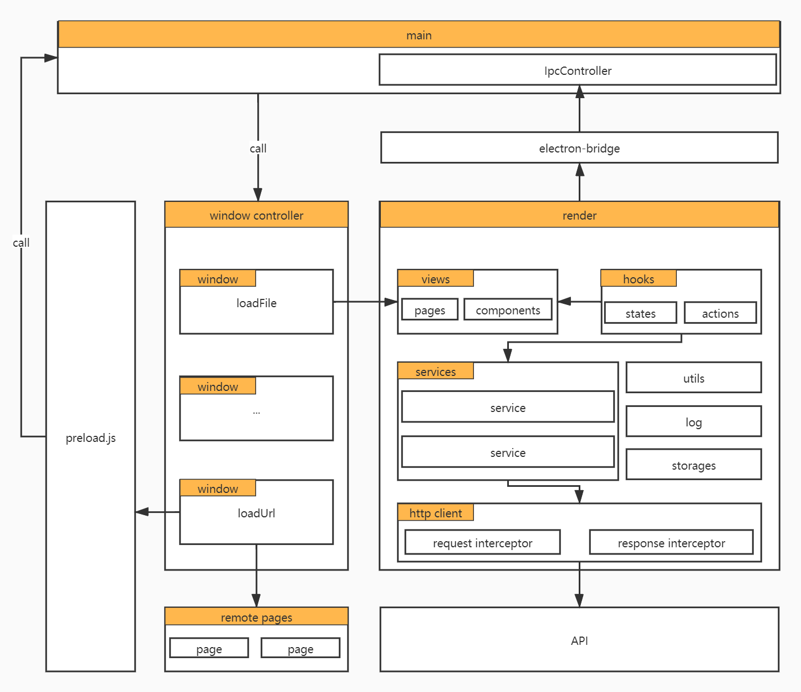
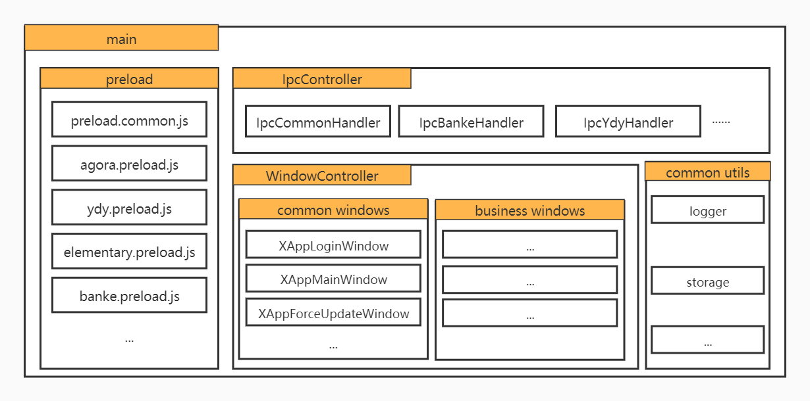
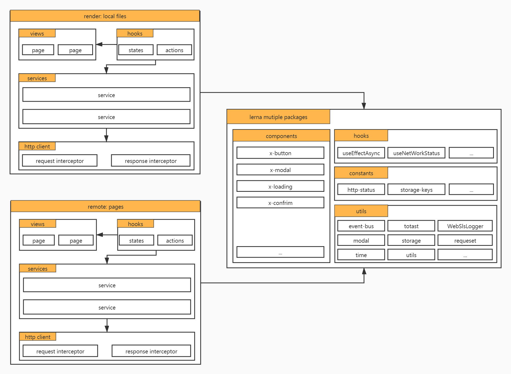
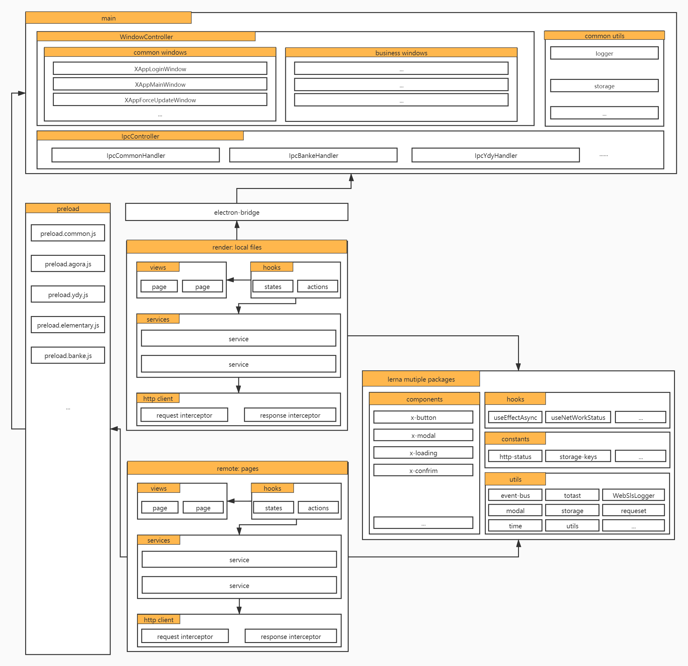

# 星火教育教师客户端架构设计

## 1 背景
星火教育教师客户端，初期设计为星火班课产品线服务的，已承接了包括：线下面授（互动课）、在线小班、在线大班等产品。随着业务调整和发展，后续星火教育教师客户端会定位了可以支撑更多产品线的重任，比如接入个性化的在线直播业务，整合旧双师互动课等等。

## 2 当前架构
### 2.1 技术选型
- 教师客户端框架脱胎于学生客户端，当时做了技术调研，过程文档可查阅[班课学生客户端技术选型](https://xiaojiaoyukeji.yuque.com/xiaojiaoxue/banke/cdwn8t)。了解到培优之前积累了`Electron`+`React`开发经验以及基于`electron-builder`打包`win/mac`签名的经验，可查看相关文档：[基于 electron-builder 的 Electron 项目开发与部署（macOS + Windows）](https://xiaojiaoyukeji.yuque.com/xiaojiaoxue/front/nygmg9)
- 班课直播已选用`Umi`+`React`+`React Hooks`，基于技术收敛考虑，确定技术栈为`Electron`+`Umi`+`React`+`React Hooks`
- 客户端加载页面方式，加载`local files`和加载`remote pages`：
  - 一般通过`loadFile`加载客户端的`render`目录下`pages`，优势：`local files`可直接调用`Electron Api`、可直接与`main`通信，在实现功能上更方便简单；劣势：打入客户端安装包，功能变更需发布客户端；随着功能膨胀，客户端大小也随着增加。
  - 一般通过`loadUrl`加载`remote pages`，优势：`remote pages`实现一套代码两端使用，更易扩展。客户端和页面物理隔离，更好解耦。功能变更一般不用发布客户端；劣势：调用`Electron Api`以及与`main`通信需通过`bridge`，页面加载会比较慢体验较差。
  - 客户端混合`loadFile`和`loadUrl`，其中大部分页面都是`local files`，只有直播页面是`remote pages`。
- 班课经过`星火教育学生客户端`和`星火教育教师客户端`两个客户端产品迭代，也沉淀了相应技术文档：
  - Electron
    - [Electron开发入门介绍](https://xiaojiaoyukeji.yuque.com/xiaojiaoxue/front/ggz7ra)
    - [Electron星火小学客户端开发](https://xiaojiaoyukeji.yuque.com/xiaojiaoxue/front/ngep2h)
    - [Electron班课客户端开发](https://xiaojiaoyukeji.yuque.com/xiaojiaoxue/front/ngep2h)
  - Umi
    - [Umi官网](https://umijs.org/zh-CN)
  - React
    - [React官网](https://zh-hans.reactjs.org/)
    - [函数式组件与类组件有何不同](https://overreacted.io/zh-hans/how-are-function-components-different-from-classes/)
    - [useEffect 完整指南](https://overreacted.io/zh-hans/a-complete-guide-to-useeffect/)
    - [React hook实践及组件规范](https://xiaojiaoyukeji.yuque.com/xiaojiaoxue/banke/ff43me)
### 2.2 架构设计

- 通过[WindowControllers](https://gitlab.xinghuolive.com/teaching-fe/teaching-banke-interaction-classroom/-/blob/master/src/main/controls/WindowController.js)管理多窗口生命周期：创建、显示、隐藏、销毁。
- `render`进程和`main`进程可以通过`ipc`或者`electron remote`进行通信，一般使用`ipc`。为了便于管理，`main`端统一在[IpcController](https://gitlab.xinghuolive.com/teaching-fe/teaching-banke-interaction-classroom/-/blob/master/src/main/controls/IpcController.js)，`render`端统一在[electron-bridge](https://gitlab.xinghuolive.com/teaching-fe/teaching-banke-interaction-classroom/-/blob/master/src/render/utils/electron-bridge.ts)。
- 所有窗口继承于窗口基类[BaseAppWindow](https://gitlab.xinghuolive.com/teaching-fe/teaching-banke-interaction-classroom/-/blob/master/src/main/controls/BaseAppWindow.js)。
- 窗口可通过两种方式加载页面
  - `loadFile`：加载本地页面，例子[XAppLoginWindow](https://gitlab.xinghuolive.com/teaching-fe/teaching-banke-interaction-classroom/-/blob/master/src/main/controls/XAppLoginWindow.js)。
  - `loadURL`：加载远程页面，例子[XAppOnlineSmallClassWindow](https://gitlab.xinghuolive.com/teaching-fe/teaching-banke-interaction-classroom/-/blob/master/src/main/controls/XAppOnlineSmallClassWindow.js)。
- 窗口加载远程页面场景下，若想和`main`进程通信，可通过挂靠在窗口上的[preload](https://gitlab.xinghuolive.com/teaching-fe/teaching-banke-interaction-classroom/-/blob/master/src/main/public/preload.js)暴露的全局对象进行。加载的本地页面一般不需要通过`preload`而是直接调用`ipc`或者`electron.remote`。
- 多窗口数据共享，一般通过[GlobalStore](./src/render/utils/store/index.ts)。
### 2.3 存在问题
- `render`越来越重：客户端大部分通过`loadFile`方式加载`local files`，随着业务膨胀会越来也重。若考虑整合其他业务线需求，则可能会变成第二个旧版教学平台，不同业务代码错综复杂杂糅在一起。
- `WindowController`和`IpcController`组织上不够清晰：`main`提供`WindowController`统一管理窗口，提供`IpcController`管理`Ipc`通信，这是两个非常重要的基础工具方法，现有实现可以满足当前需求，但再可扩展性不足。
- 完善日志体系：已接入`electron-log`和阿里云`ssl`，但还没有对二者进行整合，未考虑如何更好输出关键日志信息；缺少崩溃日志上传机制，只能去拿客户端本地的崩溃日志文件。
- 安装包越来越膨大，随着业务代码量增加，现有打包方式存在改进优化空间。

## 3 改进架构

### 3.1 main架构调整

`main`目录承载运行在`main`进程相关代码，在目录划分上需区分不同业务。
- `WindowController`：不同业务窗口在对应的目录下创建，`WindowController`将它们动态聚合，统一管理它们创建、隐藏、显示、销毁等生命周期。
- `IpcController`：不同业务`IPC`通信逻辑在对应目录下创建`Hanlder`，`IpcController`将它们动态聚合，统一管理它们绑定、解绑等功能。
- `preload`：根据不同业务创建对应的`preload`文件，文件内根据需要引用公共的比如`preload.common.js`、`preload.agora.js`等

### 3.2 render架构调整

- `render：local files`是打包到安装包的本地页面，客户端通过`loadFile`载入。该部分尽可能地轻，只承载各个业务线公共部分逻辑，比如`登陆`、`主页`等。
- `remote: pages`部署到远端服务，业务线单独部署，客户端通过`loadUrl`载入。
- `local`和`remote`必须技术栈一致，使用`Umi`+`React`+`React Hooks`。
- 将`local`和`remote`共用代码，抽离封装，发布到私有库，`local`和`remote`项目通过`npm`安装这些包。
- 使用`lerna`+`yarn workspace`管理多包项目，按职能划分为：
  - `components`：公共组件
  - `hooks`：通用`hooks`
  - `constants`：公共常量、枚举等
  - `utils`：通用工具方法

### 3.3 调整后整体架构

