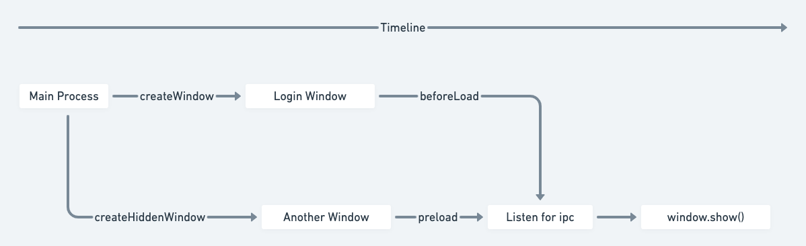

# Electron客户端开发总结

## 1 编辑窗户代码自动重启窗口
仅限窗口`js`、`preload.js`等`Electron`的代码，不包含`web`的代码，`web`自身有`webpack`热启动

### 1.1 安装模块
```json
npm install gulp --save
npm install electron-connect -save
```

### 1.2 在项目内创建gulpfile.js文件
```js
var gulp = require('gulp');
var electron = require('electron-connect').server.create();

gulp.task('watch:electron', function () {
  electron.start();
  gulp.watch(["./(preload|main|index).js"], function (done) {
    electron.restart();
    done();
  });
  gulp.watch(['./*.{html,css,scss}'], function(done) {
    electron.reload();
    done();
  });
});
```

### 1.3 package.json添加启动命令
```json
{
  "scripts": {
    "dev:test": "cross-env ELECTRON_APP_ENV=-test gulp watch:electron"
  }
}
```

### 1.4 窗口hotReload
```js
const isDevelopment = process.env.NODE_ENV !== "production"

let hotClient
if (isDevelopment) {
  hotClient = require('electron-connect').client;
}

function hotReload(window) {
  if (isDevelopment) {
    hotClient.create(window);
  }
}

function createWindow() {
  const win = new BrowserWindow({
    show: false,
    width: 1000,
    height: 600,
    titleBarStyle: 'hidden', // 标题栏的样式，有hidden、hiddenInset、customButtonsOnHover等
    webPreferences: {
      nodeIntegration: true,
      plugins: true,
      enableRemoteModule: true,
      preload: path.join(app.getAppPath(), 'preload.js')
    }
  })
  hotReload(win);
 }
```

## 2 桌面icon生成
相关配置说明：[icons](https://www.electron.build/icons)

### 2.1 Windows
提供`256*256`的ico格式图片，若需要圆角请切图的时候就切好，ico里面包含(`256`、`128`、`64`、`32`、`16`)多种尺寸，[相关资料](https://www.aconvert.com/icon/)

### 2.2 macOS
提供`1024x1024`的png格式，若需要圆角请切图的时候就切好，[相关资料](https://www.jianshu.com/p/cbbcad649e64)
- [网页生成](https://zhuanhuan.supfree.net/ling.asp?e=icns)
- 命令行生成：准备一个`1024 * 1024`的`png`图片，假设名字为`pic.png`，使用以下命令行创建一个临时目录存放不同大小的图片。
```js
// 创建一个临时目录
mkdir tmp.iconset

// 全部拷贝到命令行回车执行，执行结束之后去tmp.iconset查看十张图片是否生成好
sips -z 16 16     pic.png --out tmp.iconset/icon_16x16.png
sips -z 32 32     pic.png --out tmp.iconset/icon_16x16@2x.png
sips -z 32 32     pic.png --out tmp.iconset/icon_32x32.png
sips -z 64 64     pic.png --out tmp.iconset/icon_32x32@2x.png
sips -z 128 128   pic.png --out tmp.iconset/icon_128x128.png
sips -z 256 256   pic.png --out tmp.iconset/icon_128x128@2x.png
sips -z 256 256   pic.png --out tmp.iconset/icon_256x256.png
sips -z 512 512   pic.png --out tmp.iconset/icon_256x256@2x.png
sips -z 512 512   pic.png --out tmp.iconset/icon_512x512.png
sips -z 1024 1024   pic.png --out tmp.iconset/icon_512x512@2x.png

// 最后合成icns格式的图片
iconutil -c icns tmp.iconset -o icon.icns
```

将生成的`icon.ico`和`icon.icns`放入`/build`文件夹下（默认），打包的时候会自动引用

## 3 IPC进程通讯

### 3.1 主进程与渲染进程通讯

### 3.1.1 主进程
`electron`中的主进程是`package.json`里面的`main`配置项，在`vue`项目中，`src` => `main`文件为主进程配置文件，`src` => `renderer`文件为渲染进程文件。

### 3.1.2 渲染进程
`Electron`集成了`Chromium`来展示窗口界面，窗口中的内容使用`HTML`渲染。在`Electron`中，每创建一个新的窗口，都是一个独立的进程。如下代码，启动后会启动两个渲染界面

```js
let mainWindow
let mainWindow1
const winURL = http://localhost:9080
function createWindow () {
  //	渲染进程1
  mainWindow = new BrowserWindow({
    height: 600,
    useContentSize: true,
    width: 1000
  })
  mainWindow.loadURL(winURL)
	//	渲染进程2
  mainWindow1 = new BrowserWindow({
    height: 600,
    useContentSize: true,
    width: 1000
  })
  mainWindow1.loadURL(winURL)
}
```

### 3.1.3 BrowserWindow与html通讯

#### 3.1.3.1 主进程添加监听
```js
// index.js
// 主进程
const win = new BrowserWindow({
	webPreferences: {
      nodeIntegration: true,
      plugins: true,
      enableRemoteModule: true,
      preload: path.join(app.getAppPath(), 'preload.js')
    }
})
win.webContents.on('ipc-message', (res, arg) => {
	console.log('收到了 ping: ', arg)
})
```

#### 3.1.3.2 添加`preload.js`用来给目标网页增加`electron`的包
```js
// preload.js
window.electron = require('electron');
```

#### 3.1.3.3 在`html`添加监听与发送
```html
<!DOCTYPE html>
<html>

<head>
  <meta charset="UTF-8">
  <title>Hello World!</title>
  <meta http-equiv="Content-Security-Policy" content="script-src 'self' 'unsafe-inline';" />
</head>

<body style="background: white;">
  <script>
    const { ipcRenderer } = window.electron
    ipcRenderer.on('ipc-message', (event, message) => {
      console.log('message: ', message)
    })
    ipcRenderer.send('ipc-message', '发送 ping')
  </script>
</body>

</html>
```
### 3.2 渲染进程给主进程通讯
在`Electron`中, 我们有几种方法可以在主进程和渲染进程之间进行通信。例如使用`ipcRenderer`和`ipcMain`模块发送消息，或使用`remote`模块进行`RPC`方式的通信。

#### 3.2.1 渲染进程中
```js
//	方法1
const { ipcRenderer } = require('electron')	//	引入ipc
methods: {
	clickEvent(){
  	ipcRenderer.send('message','渲染进程发送给我主进程的消息')
  }
}

// 方法2 直接挂原型上使用
methods: {
	clickEvent(){
  	this.$electron.ipcRenderer.send('message','渲染进程发送给我主进程的消息')
  }
}
```

#### 3.2.2 主进程中
```js
ipcMain.on('message',(event,arg)=>{
  console.log(arg);
})
```
### 3.3 主进程给渲染进程通讯

#### 3.3.1 主进程
```js
//	向渲染进程发送消息
ipcMain.on('message',(event,arg)=>{
  event.sender.send('getMessage','主进程给发送消息给渲染进程')
})
```

#### 3.3.2 渲染进程
通过点击直接，先从渲染进程发送一条消息给主进程，主进程接收到以后可以判断接受到的是什么类型的消息，然后根据条件反馈给渲染进程。
```js
  clickEvent() {
    this.$electron.ipcRenderer.send("message", "666");
    ipcRenderer.on("getMessage", (event, arg) => {
      console.log(arg);
    });
  }
```

### 3.4 主进程主动发消息
- 自主到从：从`Main`到`Renderer`的消息传递，借助`BrowerWindow.webContents.send()`发送消息。
- 自从到主：从`Renderer`到`Main`的消息传递，借助`ipcRender`和`ipcMain`发送/接收消息。
- 事件机制：无论是`BrowerWindow.webContents.send()`，还是`ipc`，其实都是`node`的事件机制，都是`EventEmitter`的实例。

#### 3.4.1 主进程
```js
//	在创建的生命周期
function createWindow() {
  mainWindow.webContents.on('did-finish-load', function(){
    mainWindow.webContents.send('main','我是主进程：我送消息了')
  })
}
```

#### 3.4.2 渲染进程
```js
created() {
    ipcRenderer.on('main',(event,args)=>{
      console.log(args)
    })
}
```

### 3.5 移除监听
渲染进程中增加了`ipc`监听回调后，需要在退出页面的时候移除`removeListener`监听回调，否则会多次订阅同一事件，引起内存泄漏。
如果使用`removeAllListeners`方法则会把渲染进程所有同名监听都移除，导致其他地方监听不到，不建议使用。

## 4 加载指定路由页面
`BrowserWindow`有`loadURL`和`loadFile`两个方法加载指定的链接或者静态文件:
- [loadURL](https://www.electronjs.org/docs/latest/api/browser-window#winloadurlurl-options)：可以直接传入`localhost:9090`、`https://www.xinghuo100.com/zt/hc2021/index.html`等格式
- [loadFile](https://www.electronjs.org/docs/latest/api/browser-window#winloadfilefilepath-options)：可以加载本地目录的`index.html`文件

可以使用该方法打开多个弹窗，每个弹窗加载指定的路由。这里需要借助`loadFile`的`option`参数，添加`hash`字段，指向需要访问页面的路由。如果需要`query`参数，还可以添加`query`字段进行传参。

```js
if (isDevEnv) {
  return this.loadURL(`${http://localhosty:9090}/#/${page}`)
} else {
  return this.loadFile(path.join(__dirname, '../render/dist/index.html'), { hash: `#/${page}` })
}
```
每个渲染进程里面加载的页面数据都是独立的，不会互相干扰，如果需要把登录窗口的登录信息传递到主窗口，后续也会在进程间传参中讲到。

## 5 开发场景

### 5.1 优化打开速度
为了加快打开窗口的速度，我们可以在主进程启动的时候优先创建窗口，但是不把创建的窗口显示出来，配置`show`为`false`，后续可以通过`IPC`消息通知主进程，去把这个`window`展示出来。



### 5.2 常用功能场景

#### 5.2.1 不需要窗口title的情况
```js
// 隐藏标题，window无效
titleBarStyle: 'hidden'
```

#### 5.2.2 定制mac交通灯按钮位置
```js
// 调整mac交通灯控制按钮位置，window无效
trafficLightPosition: {
  x: 20,
  y: 40,
},
```

#### 5.2.3 放大按钮由真全屏改为最大化（mac）
```js
fullscreenable: false
```

#### 5.2.4 去除标题，控制按钮（需自行实现放大、缩小、关闭控制按钮）
```js
frame: false
```

#### 5.2.5 新窗口位置以父窗口为准
```js
// 传入父窗口实例
parent: BrowserWindow

// 或者调用方法动态设置
children.setParentWindow(parent)
children.setParentWindow(null)
// 在父窗口居中
children.center()

// 指定在父窗口的位置
children.setParentWindow(parent);
const position = children.getPosition();
children.setPosition(position[0] + 467, position[1] + 151);
```

#### 5.2.6 窗口web内容没有加载完成前显示loading
```js
// 创建一个BrowserView加载静态html文件并设置到window中即可
windowLoading() {
  this.browserView = new BrowserView();
  this.mWindow.setBrowserView(this.browserView);
  this.browserView.setBounds({
    x: 0,
    y: 0,
    width: 1024,
    height: 768,
  });
  this.browserView.webContents.loadURL(`file://${path.join(__dirname, 'loading.html')}`);
}
```
#### 5.2.7 窗口url加载失败处理
加载外部网址`url`的时候有可能会由于外部网络，网站崩溃，服务器超载等原因失败，或者长时间未响应，这时候可以通过一个`setTimeout`在`6000ms`之后去检测是否弹窗提示
```js
const { dialog } = require('electron');

let isLoaded = false;
let timer = null;

checkUrlTimeout() {
  clearTimeout(this.timer);
  this.timer = setTimeout(() => {
    if (!this.isLoaded) {
      this.showErrorDialog();
    }
  }, 6000);
}

this.loadFile(
  path.join(__dirname, '../render/dist/index.html'),
  option
).then(() => {
  logger.log('loadWindowUrl success');
  this.onLoadUrlSuccess();
}).catch((e) => {
  logger.log(`loadWindowUrl error: ${e}`);
  this.onLoadUrlFail(e);
}).finally(() => {
  this.onLoadUrlFinally();
});

// 监听窗口发送的IPC事件web加载成功
onLoadUrlSuccess() {
  isLoaded = true;
}

onLoadUrlFail() {
  this.showErrorDialog();
}

onLoadUrlFinally() {
  this.checkUrlTimeout();
}

showErrorDialog() {
  dialog
    .showMessageBox(this.mWindow, {
    title: '温馨提示',
    message: '直播间加载异常, 是否重新加载?',
    buttons: ['重新加载'],
    defaultId: [0],
  }).then((res) => {
    console.log('showMessageBox: ', res);
    // 重新加载url
  });
}
```

#### 5.2.8 避免电脑进入省电模式
```js
// 比如：打开某个窗口的时候避免黑屏
const { powerSaveBlocker } = require('electron');
// 避免省电
this.powerId = powerSaveBlocker.start('prevent-display-sleep');
// 恢复原状
 if (this.powerId && powerSaveBlocker.isStarted(this.powerId)) {
   powerSaveBlocker.stop(this.powerId);
 }
```

#### 5.2.9 自动打开调试工具栏
```js
this.mWindow.openDevTools();
```

#### 5.2.10 多次打开应用避免多开的解决
在主进程主文件中增加`second-instance`事件监听
```js
handleKeepSingleApp() {
  // 限制只可以打开一个应用
  const gotTheLock = app.requestSingleInstanceLock();
  logger.log('gotTheLock', gotTheLock);
  if (!gotTheLock) {
    app.quit();
  } else {
    app.on('second-instance', () => {
      // 当运行第二个实例时,将会聚焦到当前窗口
      // 需要自行实现记录当前打开的窗口实例
      if (this.currentWindow) {
        if (this.currentWindow.isDestroyed()) {
          app.quit();
          return;
        }
        if (this.currentWindow.isMinimized()) {
          this.currentWindow.restore();
        }
        this.currentWindow.focus();
        this.currentWindow.show();
      }
    });
  }
}
```

#### 5.2.11 添加快捷键或者禁止某快捷键
使用`globalShortcut`来实现快捷键注册，返回`false`标识禁止响应。
```js
const { globalShortcut } = require('electron');

app.whenReady().then(() => {

  // 在打包线上环境的时候才禁止，否则不方便本地调试
  if (APP_ENV === ELECTRON_ENV.PRD) {
    this.initShortcut();
  }
});

initShortcut() {
  globalShortcut.register('F5', () => {
    logger.log('禁止F5!');
    return false;
  });
  globalShortcut.register('Alt+CommandOrControl+I', () => {
    logger.log('mac禁止开启调试窗口!');
    return false;
  });
  globalShortcut.register('Control+Shift+I', () => {
    logger.log('window禁止开启调试窗口!');
    return false;
  });
  globalShortcut.register('Command+R', () => {
    logger.log('mac禁止刷新窗口!');
    return false;
  });
  globalShortcut.register('Control+R', () => {
    logger.log('window禁止刷新窗口!');
    return false;
  });
}
```

#### 5.2.12 设置mac左上角菜单
```js
const { Menu } = require('electron');
// https://www.electronjs.org/docs/api/menu
// 没有设置在左上角菜单的快捷键，mac上的快捷键无法运行
const menuTpl= {}
const menu = Menu.buildFromTemplate(menuTpl);
Menu.setApplicationMenu(menu);
```

### 5.2.13 多屏幕场景下从鼠标焦点所在屏幕打开新的窗口
```js
const { screen } = require('electron');

// 获取当前鼠标指针在屏幕的坐标
const point = screen.getCursorScreenPoint();

// 根据坐标获取最接近的屏幕
const display = screen.getDisplayNearestPoint(point);

// 计算窗口居中左上角点位
const x = Math.floor((display.workAreaSize.width - 窗口.width) * 0.5) + display.bounds.x;
const y = Math.floor((display.workAreaSize.height - 窗口.height) * 0.5) + display.bounds.y;

// 设置窗口定位
this.mWindow.setBounds({ x, y });
```

### 5.2.14 监听窗口崩溃重新运行当前窗口
```js
// 监听窗口内容崩溃
window.webContents.on('render-process-gone', (event, detail) => {
  // details Object
  //   reason String - The reason the render process is gone. 可选值
  //     clean-exit - Process exited with an exit code of zero
  //     abnormal-exit - Process exited with a non-zero exit code
  //     killed - Process was sent a SIGTERM or otherwise killed externally
  //     crashed - Process crashed
  //     oom - Process ran out of memory
  //     launch-failed - Process never successfully launched
  //     integrity-failure - Windows code integrity checks failed
  console.error('render-process-gone reason: ', detail.reason);
  ...
  关闭窗口
  window && window.close();
  ...
  重新创建窗口
  window = new XAppMainWindow();
});
```

## 6 日志
使用[electron-log](https://www.npmjs.com/package/electron-log)作为日志记录工具

### 6.1 目录

### 6.1.1 macOS
`~/Library/Logs/{app name}/{process type}.log`
例如：`/Users/我的用户/Library/Logs/banke-live-student-client`

### 6.1.2 Windows
`%USERPROFILE%\AppData\Roaming\{app name}\logs\{process type}.log`
例如： `C:\Users\晓教育\AppData\Roaming\banke-live-student-client\logs`

### 6.2 配置
```js
const log = require('electron-log');
// 是否在控制台打印
log.transports.console.level = true/false;
// 是否输出到日志文件
log.transports.file.level = true/false;
// 指定日志的域
log.scope('AppLiveWindow');
```

## 7 常见问题

### 7.1 在macOS的浏览器上使用灰阶渲染字体，修复字体过粗的问题
[相关文章](https://blog.csdn.net/u013224660/article/details/79530015)
```css
-webkit-font-smoothing: antialiased; //开启chrome在macOS上的灰阶平滑
-moz-osx-font-smoothing: grayscale; //开启firefox在macOS上的灰阶平滑
```

### 7.2 Windows系统窗口间切换导致偶现窗口无法聚焦无法操作的问题

#### 7.2.1 原因
`windows`系统多窗口的程序在一个窗口设置`hide()`或者`destroy()`触发销毁回调`closed`之前另一个窗口没有调用`show()`，此时就会导致`show`新窗口无法聚焦出现假死状态，需要点击其他窗口或者移动一下才会恢复正常。

#### 7.2.2 解决
- 首次显示：将窗口第一次显示设置`show: true`, `opacity: 0`, 窗口加载完显示时设置`opacity: 1`
初步判断复现情况是`Windows`系统在程序在运行时某个时间段没有窗口显示，随后主进程再将某个窗口显示出来，这时聚集点可能还是桌面，导致无法聚焦到当前窗口
- 在旧的窗口监听`close`事件，在事件回调里面去`show`新的窗口

### 7.3 升级Electron 11 ->Electron 12报“Uncaught ReferenceError: require is not defined”
- 参考：[electron 5.0.0 “Uncaught ReferenceError: require is not defined”](https://stackoverflow.com/questions/55093700/electron-5-0-0-uncaught-referenceerror-require-is-not-defined)
- 原因：[contextIsolation上下文隔离Electron 12默认开启](https://www.electronjs.org/docs/latest/tutorial/context-isolation#:~:text=What%20is%20it%3F%20Context%20Isolation%20is%20a%20feature,powerful%20APIs%20your%20preload%20script%20has%20access%20to)


