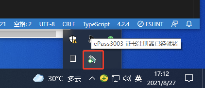
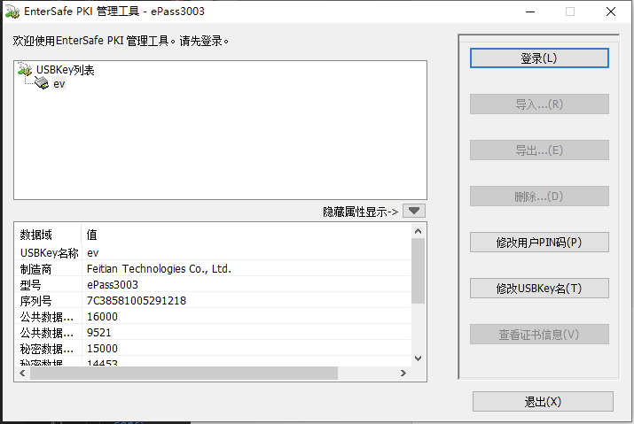
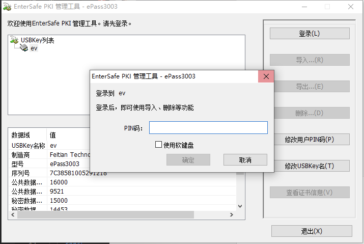
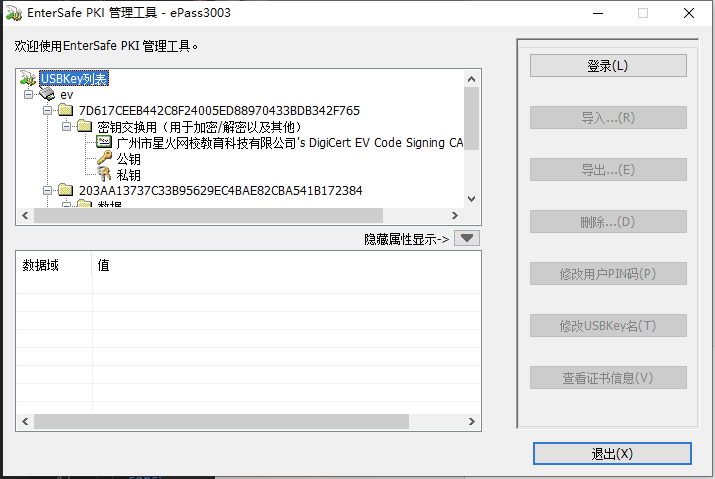
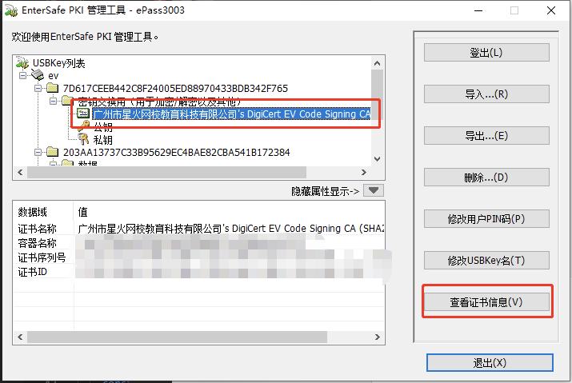
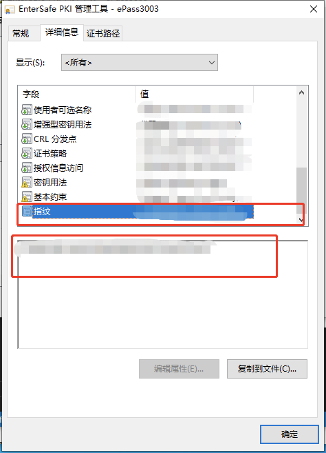

# Electron Windows EV签名

## 1 相关文章
- [sign 命令选项](https://docs.microsoft.com/zh-cn/dotnet/framework/tools/signtool-exe#sign)
- [使用 SignTool 对文件进行签名](https://docs.microsoft.com/zh-cn/windows/win32/seccrypto/using-signtool-to-sign-a-file)
- [客户端签名](https://bbs.wosign.com/thread-3531-1-1.html?tdsourcetag=s_pctim_aiomsg)
- [命令行签名](https://bbs.wosign.com/forum.php?mod=viewthread&tid=3300#lastpost)

## 2 工具
选用[沃通](https://buy.wosign.com/ApplyForCodeSign.html)，需要购买证书。

## 3 步骤

### 3.1 请按照`ukey`类型下载`ukey`的驱动并安装
- [白色ukey](https://www.wosign.com/download/ePass3003.rar)
- [黑色ukey+白色图标](https://download.wotrus.com/wotrus/mkey/MKeyTool.exe)
- [黑色ukey+白色尾部](https://www.wosign.com/Support/file/Usbkey_SafeNet.zip)

### 3.2 插上Ukey


### 3.3 下载signtool签名工具
[点击下载](https://www.wosign.com/download/Signtool.rar)

### 3.4 打开UKey



### 3.5 登录UKey


### 3.6 输入PIN密码


### 3.7 登陆成功


### 3.8 查看证书密钥


### 3.9 复制指纹


### 3.10 把下载的`signtool`工具根目录添加到环境变量

### 3.11 把指纹配置到环境变（`BANKE_LIVE_STUDENT_CLIENT_ACCESS_SIGN_SECRET`）

### 3.12 运行签名命令
`banke-student-live-client`项目已经有相关的命令行工具，可以用这个脚本来运行签名
路径：`banke-student-live-client\scripts\winsign.js`

- 签名命令：签名命令之后需要输入PIN密码
```json
signtool sign /v /sha1 第9步复制的指纹 /fd sha256 /td sha256 /tr http://timestamp.digicert.com xxxAPP.exe程序的路径
```
- 验证签名是否成功的命令：
```json
signtool verify /v /pa xxxAPP.exe程序的路径
```


