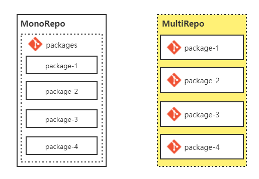
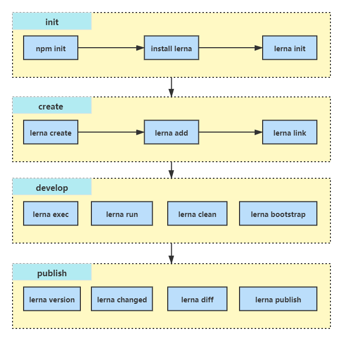

# monorepo预研

## 1 前言
### 1.1 基本概念
`monorepo`的全称是`monolithic repository`，即单体式仓库。`monorepo`是把所有相关的`package`放在同一仓库下进行管理，而每个`package`又可单独发布`npm`。使用该方式比较有名的库有：`Babel`、`React`、`Angular`。

与之对应的即是`multirepo`，全称`multiple repository`，这是比较传统方式，每个`package`单独一个仓库管理。使用该方式比较出名的库有：`Rollup`。

### 1.2 `monorepo` vs `multirepo`
#### 1.2.1 组织方式

#### 1.2.2 优缺对比
- monorepo
  - 优点：
    - 一个仓库维护多个模块，不用到处找仓库
    - 方便版本管理、依赖管理，模块间引用、调试方便，通过命令即可搞定
    - 方便统一生成CHANGELOG，配合提交规范，可在发布时自动生成CHANGELOG
  - 缺点：
    - 对构建工具要求高，可以构建各种模块
    - 仓库体积变大
    - 各个模块代码权限控制问题
- multirepo
  - 优点：
    - 各模块管理自由度高，可自行选择构建工具、依赖管理等基础设施
    - 各模块仓库小
    - 各模块物理隔离
  - 缺点：
    - 分库多，不好找
    - 版本更新频繁，若公共模块的版本变更，需对所有模块进行依赖更新
    - CHANGELOG梳理困难，无法较好地自动关联模块的变动

## 2 背景
统一工具库建设有一段时间，回顾总结：
### 2.1 现状
- 范围清晰，聚焦通用型的工具方法
- 多模块多仓库，一个模块对应一个仓库
- 提供统一基础设施配置，比如使用TypeScript编写、生成type文件、代码规范检测、提交规范检测等等
- 后续规划统一文档，建立文档站点等
- 模块间存在相互依赖，尤其是依赖基础型模块
### 2.2 问题
- 统一管理困难：这是多仓库带来的问题。虽然规定在同一分组`teaching-utils`下创建仓库，但随着模块增多仓库数量也随着增加，对代码管理带来不便。
- 模块调试不便：模块相互依赖，需要下载多个仓库，通过`npm link`多个模块。
- 建立文档站点：如何在多仓库收集文档，创建统一文档站点呢？是个难题。
### 2.3 `monorepo` or `multirepo`
对比`monorepo`和`multirepo`优缺点，结合我们以上的实际情况，`monorepo`会更契合。

## 3 Lerna

### 3.1 概念
对`Lerna`描述如下：
>A tool for managing JavaScript projects with multiple packages. `Lerna` is a tool that optimizes the workflow around managing multi-package repositories with `git` and `npm`.

以上描述可能还比较抽象，我们试着结合管理多模块实际场景来说明使用`Lerna`的优势。

### 3.2 使用前场景
- 如何感知哪些包有变更
- 如何判断哪些包需发版
- 手动维护各个包版本号
- 切换到各个包运行发布

### 3.3 使用后场景
- 通过`git commit`感知文件变更
- 通过配置判断变更是否需要发版
- 通过`npm semver`维护包的版本号
- 通过不同模式对包进行发布

### 3.4 包管理模式
`Lerna`对包管理有两种模式：`fixed`(固定模式)、`independent`(独立模式)。

- `fixed`(固定模式)：所有包是统一的版本号，每次升级，所有包版本统一更新，不管这个包内容改变与否。`Lerna`的配置文件`lerna.json`中存在一个确定版本号：
```json
{
  "version": "0.0.1"
}
```
- `independent`(独立模式)：每个包是单独的版本号，每次lerna 触发发布命令，每个包的版本都会单独变化。`Lerna`的配置文件`lerna.json`中没有一个确定版本号：
```json
{
  "version": "independent"
}
```

### 3.5 开发流程


#### 3.5.1 初始
- 创建根目录包：运行`npm init`
- 全局安装`lerna`：运行`npm install -g lerna`
- 初始化项目
  - `lerna init`：默认为`fixed mode`(固定模式)，所有包共用一个`version`(版本号)
  - `lerna init -i`：使用`independent mode`(独立模式)，每个包有独立的`version`(版本号)

#### 3.5.2 创建

#### 3.5.2.1 创建包
- `npm init`创建
  ```
  mkdir package-a
  cd package-a
  npm init
  ```
- `lerna create`创建
  ```
  lerna create package-b
  lerna create @xfed/teaching-toolkit --access public
  ```
#### 3.5.2.2 安装依赖
`lerna add <package>[@version][--dev]`向`packages`内的包安装依赖，该命令让`lerna`追踪包间的依赖关系。建议按照依赖包时，通过此命令，而不是直接运行`npm add`或`yarn add`。

默认会对`packages`下所有的包安装依赖，若只想针对某个包，则在命令添加`--scope`。比如：`lerna add package-c --scope=package-a`，表示添加`package-c`到`package-a`依赖中。
#### 3.5.2.3 Symlink
`lerna link`将相互依赖的所有包`Symlink`链接在一起，如此就不需从远端下载依赖包，方便开发时对包进行本地调试。

#### 3.5.3 开发
- `lerna bootstrap`：`lerna link`+`yarn install`，用于创建`symlink`和安装依赖包。
- `lerna run`：会像执行一个`for`循环一样，在所有子项目中执行`npm script`脚本，它会识别依赖关系，从根依赖开始执行命令。
- `lerna exec -- <command> [..args]`：功能同`lerna run`，它可以执行任何命令，比如`shell`脚本。
- `lerna clean`：清理`packages`下每个包的`node_modules`。

#### 3.5.4 发布
- `lerna version`：智能识别有变更的包，生成新的版本号，并且更新包的依赖关系，是`lerna publish`的前置命令。
- `lerna publish`：发布有变更的包，需要在运行`lerna`命令之前，使用`git commit`提交代码，`lerna`才能感知文件变更。

## 4 yarn workspace

### 4.1 what
>Workspaces are a new way to set up your package architecture that’s available by default starting from Yarn 1.0. It allows you to setup multiple packages in such a way that you only need to run `yarn install` once to install all of them in a single pass.

简而言之，其实`yarn workspace`是`yarn`自`1.0`版本起就默认支持的，处理`monorepo`项目的依赖管理机制。允许在单仓库根目录下管理多个`package`的依赖。

### 4.2 why
- 多个`package`间相互依赖，`workspace`会自动对`package`设置`symlink`，比`npm link`/`yarn link`更加方便。并且`symlink`仅限在当前`workspace`，不会影响全局。
- 项目下所有`package`依赖会优先安装在根目录的`node_modules`下，可以最大限度地复用依赖包，节省磁盘空间。
- 项目下所有`package`使用同一`yarn.lock`，可减少冲突和易于审查。

### 4.3 how
在多`package`项目根目录下，添加`package.json`，自此改项目的根目录称之为`workspace root`：
```json
{
  "name": "mono-workspace",
  "version": "0.0.1",
  "private": true,
  "workspaces": ["workspace-a", "workspace-b"]
}
```
- `private`：一般`workspace root`不需发布`npm`的，设置为`true`则可以确保不被发布出去。
- `workspaces`：声明各个`package`的路径，允许是具体路径或者通配符，比如社区的常见写法，匹配所有`package`的写法`packages/*`。

### 4.4 常用命令

