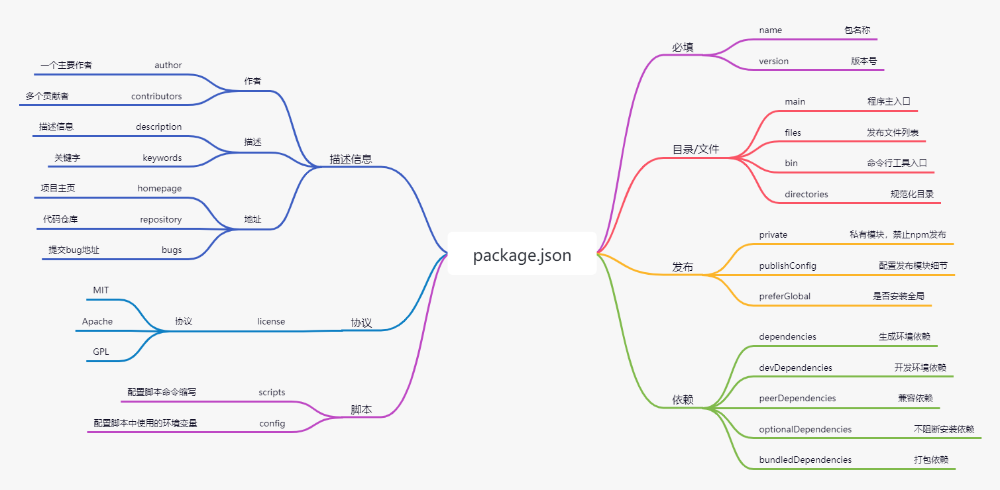
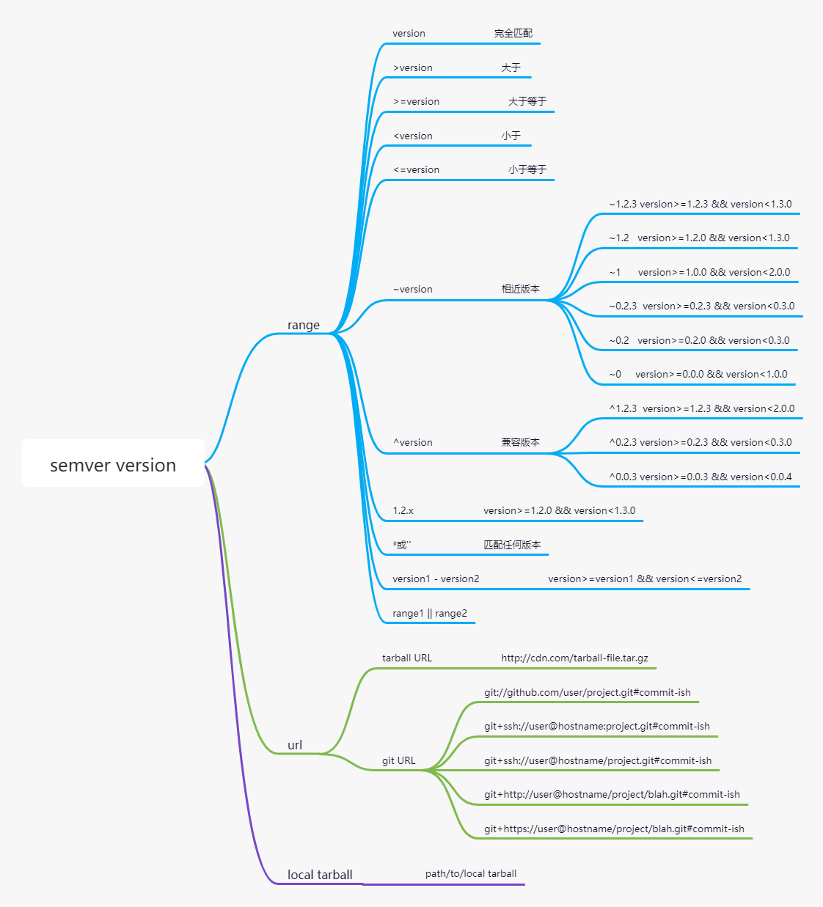
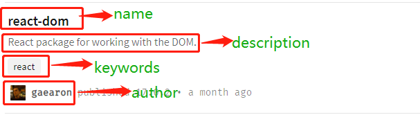
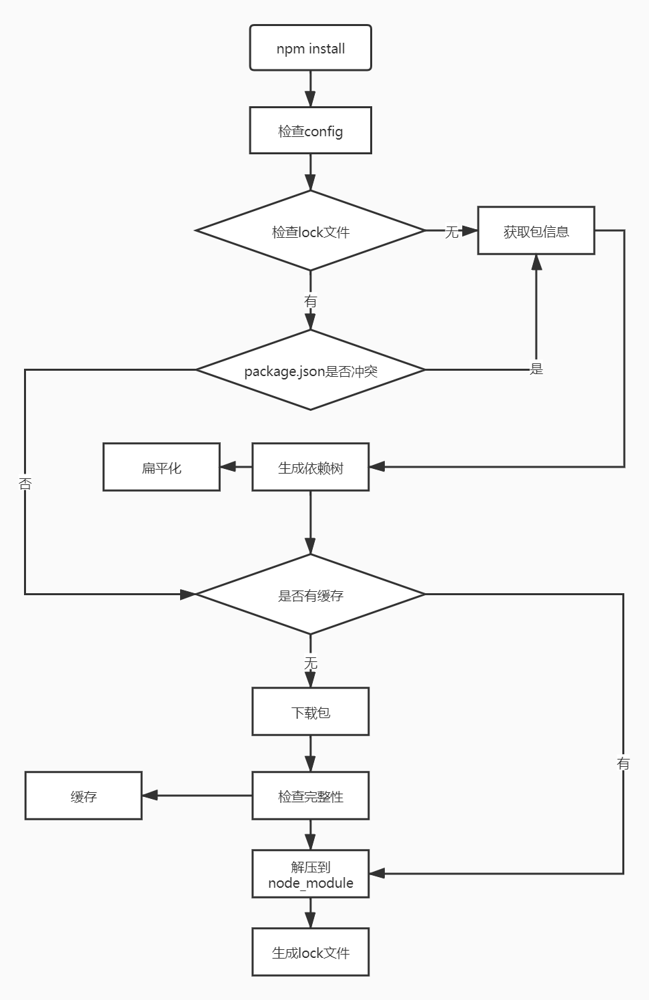
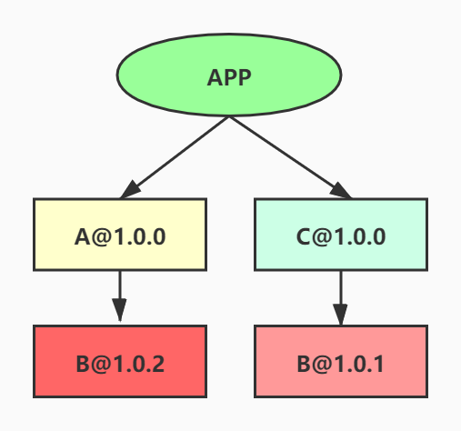
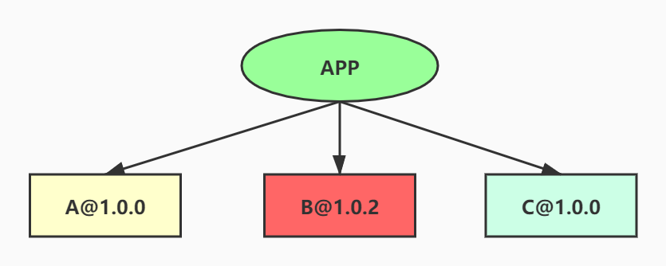
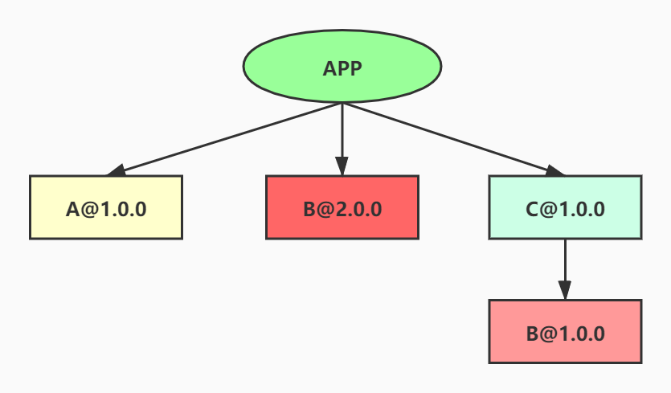

# npm：Node Package Management

## 0 前言
在说`npm`前，先了解一下`JavaScript`代码共享历史，有助于对`npm`有更清晰和深入的认识。

### 0.1 石器时代-各种网站
在包管理器还没出现前，使用开源`JavaScript`很麻烦，既不方便又不安全，需要在网络上到处找。如果有官网是最好的，从野鸡网站下载就要担心会不会植入恶意代码了。
### 0.2 青铜时代-GitHub
后来出现了同性社交网站`GitHub`，开源者在上面共享代码，使用者在上面找需要的库，下载后拷贝到项目。emm....`我们不直接生产代码，我们是代码的搬运工`。解决到处找代码问题，安全也比较有保障。但也存在问题：
- 版本管理: 库升级了，要手动下载新版本的文件更新到项目。
- 依赖管理：库依赖其他库时，要手动将依赖库依次下载。
### 0.3 黄金时代-包管理
人是善于偷懒了，虽然`GitHub`解决了找的问题，但下载还需手动。搬运虽好，但也没有不搬爽啊。如果有工具帮忙处理，岂不美哉。`JavaScript`社区人才辈出，顺势推出了几款`包管理器`。比如`brower`，`npm`等。`npm`是`Node Package Manager`的缩写。
>npm is the world's largest software registry. Open source developers from every continent use npm to share and borrow packages, and many organizations use npm to manage private development as well.npm consists of three distinct components：the website；the Command Line Interface (CLI)；the registry.

如上所述，`npm`，它有个[官网](https://www.npmjs.com/)；它提供`cli`命令，`install package`、`publish package`，帮助使用者管理`JavaScript`代码库；它提供注册服务器。它的生态是完备。

那为何这么多包管理器，最终王者是`npm`，这个就要提到背后'爸爸'：`Node`。`Node`刚出来的时候，是缺少包管理，而建立的生态，它是必备。当时`Isaac Z. Schlueter`找到`Node`之父`Ryan Dahl`，交流设计`npm`理念，两位大神一拍即合。由`Isaac`负责开发出`npm`工具，作为`Node`内置包管理器。随着`Node`生态不断壮大，`npm`也顺理成章地成为`Node`和`JavaScript`生态事实标准了。

`npm`帮助我们：
- 安装快捷：不用到处找文件，只需在[包管理](https://www.npmjs.com/package/package)页面中，查找已发布到`npm`注册服务器上的开源库，运行命令`npm install`
- 发布简便：库目录结构参照[npm/cli](https://github.com/npm/cli)。运行命令`npm init`，生成包描述元数据文件`package.json`；遵循`CJS`、`ESM`、`UMD`等[模块规范](https://xiaojiaoyukeji.yuque.com/xiaojiaoxue/front/gcnbox)导出代码；构建编译后，运行`npm publish`。即可将库发布到`npm`服务器上
- 管理依赖：库引用其他库形成依赖关系，`npm`会根据规则处理好，库使用者无需操心
- 管理版本：发布时，需要变更版本号；使用时，有不同规则来满足对不同版本引用场景。升级库也非常简单，运行`npm update`
## 1 package
`package`是`npm`管理`JavaScript`包/库的主要对象。
### 1.1 目录
以[npm/cli](https://github.com/npm/cli)为例，目录结构如下：
```
├─bin
├─changelogs
├─docs
├─lib
├─node_modules
├─scripts
├─test
├─package.json
```
对目录和文件做简单说明：
- bin：存放二进制文件
- changelogs：存放版本变更描述文件
- docs：存放API等文档
- lib：存放包/库的源码
- node_modules：存放所依赖的包/库
- scripts：存放实现脚本命令的文件
- test：存放测试用例文件
- package.json：描述包信息文件，后面会重点说明各个字段含义和作用
### 1.2 类型
根据权限划分为两种类型：`public package`和`private package`。
#### 1.2.1 private package
`private package`：私有包是在`npm`服务器上，只对特定组织和成员可见的`package`。私有包一般都有作用域`scope`，拥有作用域`scope`的包默认是私有的。
#### 1.2.2 scope
`scope`标识组织或个人名称，使用它关联相关的`package`，形如：`@scope/package-name`
- 登录到私有仓库：`npm login --registry=https://your-primate-npm-server.com`
- 发布到私有仓库：`npm publish --registry=https://your-primate-npm-server.com`

## 2 package.json
高质量的`JavaScript`包/库，都需要配置合理的`package.json`。接下来，让我们了解各个配置项含义和作用。好，开局一张图，内容全靠`编`。[package.json](https://www.processon.com/view/link/607930917d9c08283dcc6bf9#map)


### 2.1 必填信息
若想将自己的包发布到`npm`，有两个字段必填：`name`和`version`。`name`和`version`组成包的唯一标识。
#### 2.1.1 name
`name`即是包的名称，需遵循规范：
- `name`会用于生成包的访问链接，比如`react`在`npm`网站上的访问地址[react](https://www.npmjs.com/package/react)，所以不能包含任何非`URL`安全的字符
- 不得包含大写字母，长度不得大于**214**个字符
- 建议单词之间使用`-`分割
- 建议不要包含`js`或`node`等字眼，推荐安装[validate-npm-package-name](https://www.npmjs.com/package/validate-npm-package-name)校验合法性
- 建议使用`@scope`，将包发布到自己的或者组织的作用域下，避免命名冲突。例如`angular`组织下的库，`@angular/core`、`@angular/compiler`
在发布之前，先运行`npm view packageName`来确保`name`是否可用：若被占用则，则会显示包的信息；若未占用，则会显示404异常。当然，也可以到[npm官网](https://www.npmjs.com/package/package)用名称搜索包是否存在。
#### 2.1.2 version
`version`遵循[Semver](https://semver.org/)规范，`Semver`是由`Github`起草，统一版本号的规则。主要分成两种类型：
- 标准版本
- 先行版本
#### 2.1.1 标准版本
采用`X.Y.Z`形式，`X`、`Y`、`Z`为正整数，不能在数字面前补零。`X`是`主版号`；`Y`为`次版号`；`Z`为`修订号`。各个版本数字的意义为：
- `X`：不向下兼容
- `Y`：向下兼容新增功能性
- `Z`：向下兼容问题修复
#### 2.1.2 先行版本
若版本变动较大，并且功能未稳定，需发现先行版来让大家试用。采用`X.Y.Z-a.xxxx`，其中`X.Y.Z`遵循`标准版本`规则，`a`为先行版本标识符，`xxxx`为版本编译信息。其中`a`的取值一般有：
- `alpha`：内部版本
- `beta`：公测版本
- `rc`：正式候选版
#### 2.1.3 发布版本
发布新版本，不建议直接修改`package.json`的`version`，如果误操作，会导致版本混乱。推荐使用命令进行升版。命令如下：
- `npm version patch`：升级`修订号`
- `npm version minor`：升级`次版号`
- `npm version major`：升级`主版号`

### 2.2 依赖关系
项目可能会用到外部包，需要根据它们的用途，配置到对应的字段里。比如`dependencies`、`devDependencies`、`peerDependencies`、`bundledDependencies`。
#### 2.2.1 配置规则
依赖关系可以使用以下形式表示：
- `package name: version range`：`version range`遵守[semver](https://docs.npmjs.com/cli/v6/using-npm/semver)规范
- `package name：git url`
- `package name: tarball`


#### 2.2.2 dependencies
项目运行所需依赖的外部包，编译构建时，会将所配置配置依赖模块打进包里，所以需要留意模块是必须，不要引入多余无用的模块。
```json
{
  "rxjs": "~6.6.3",
  "echarts": "^5.0.2"
}
```
#### 2.2.3 devDependencies
有些模块只在开发模式下才需要，比如：代码规范`eslint`、样式预处理`less`、测试框架`jest`等，打包后剔除这些模块也可运行，所以不需要将它们打到包里，这时就该把它们写到`devDependencies`。
```json
 "devDependencies": {
    "eslint": "^7.18.0",
    "typescript": "^3.8.3"
 }
```
#### 2.2.4 peerDependencies
用于指定你当前包的宿主必须要安装的包的版本。举个例子：常用的`react`组件库[antd@4.x](https://github.com/ant-design/ant-design/blob/master/package.json)的`package.json`，有如下配置：
```json
{
  "peerDependencies": {
    "react": ">=16.9.0",
    "react-dom": ">=16.9.0"
  }
}
```
若项目中用到`antd@4.x`，则项目必须先安装`react`版本区间`>=16.9.0`和`react-dom`版本区间`>=16.9.0`。在`npm@2`中，当下载`antd@4.x`，`peerDependencies`中指定的依赖会随着`antd@4.x`模块一起被强制安装。但`npm@3`后，不再强制安装`peerDependencies`的依赖模块，只是通过警告提醒，这时就应该在`package.json`中手动添加这些依赖。
#### 2.2.5 optionalDependencies
使用的某些依赖模块无法安装，但又想`npm install`可以继续进行，则可把这些依赖模块放到`optionalDependencies`。运行`npm install --no-optional`安装项目依赖时，若`optionalDependencies`中的模块安装失败，`npm`仍会继续进行。但在使用到`optionalDependencies`依赖模块的地方需要做好异常处理。
`optionalDependencies`会覆盖`dependencies`相同名称的依赖模块，所以只要在一个地方声明即可。
#### 2.2.6 bundledDependencies
这个依赖项也可以记为`bundleDependencies`，与其他依赖项不同，它不是一个键值对对象，而是一个数组，数组里是包名字符串，例如：
```json
{
  "name": "project",
  "version": "1.0.0",
  "bundleDependencies": [
    "axios",
    "lodash"
  ]
```
当使用`npm pack`的方式来打包时，上述的例子会生成一个`project-1.0.0.tgz`的文件，在使用了`bundledDependencies`后，打包时会把`Axios`和 `Lodash`这两个依赖一起放入包中，之后有人使用`npm install project-1.0.0.tgz`下载包时，`Axios`和`Lodash`这两个依赖也会被安装。需要注意的是安装之后`Axios`和`Lodash`这两个包的信息在`dependencies`中，并且不包括版本信息：
```json
{
  "dependencies": {
    "axios": "*",
    "lodash": "*"
  },
  "bundleDependencies": [
    "axios",
    "lodash"
  ]
}
```
如果我们使用常规的`npm publish`来发布的话，这个属性是不会生效的，所以比较少用这个配置，了解即可
### 2.3 脚本配置
#### 2.3.1 scripts
```json
{
  "scripts": {
    "doc": "typedoc --out doc src/index.ts",
    "start": "microbundle watch --output lib --no-compress",
    "build": "eslint --ext .jsx,.js,.ts,tsx src/ && microbundle --output lib --no-compress && typedoc --out doc src/index.ts"
  }
}
```
`scripts`用来配置脚本命令的缩写，各个脚本可自由组合，配置后可通过`npm run commandName`接对应的命令缩写即可调用，比如运行构建命令`npm run build`。
#### 2.3.2 config
`config`用来配置脚本需要使用的变量，如可以通过`process.env.npm_package_config_port`获取变量`port`的值：
```json
{
  "config": { "port": "8000" }
}
```
### 2.4 描述信息

#### 2.4.1 基本描述
基本描述，包括两个字段`description`和`keywords`。其中`description`用于表述包的基本信息，`keywords`用于表述包的关键标签。
```json
{
  "description": "React package for working with the DOM.",
  "keywords": [
    "react"
  ]
}
```
#### 2.4.2 开发人员
开发人员包括两种：
- `author`：作者
- `contributors`：贡献者
`contributors`值是数组。它们的值可以是字符串，也可以是对象。
```json
{
  "name" : "lightunderblack",
  "email" : "lightunderblack@gmail.com",
  "url" : "https://github.com/lightunderblack"
}
```

#### 2.4.3 地址相关
- `homepage`：包的官方主页
- `repository`：包的代码仓库地址
- `bugs`：指定一个网址或邮箱，联系反馈提交包的bug
```json
{
  "homepage": "https://reactjs.org/",
  "repository": {
    "type": "git",
    "url": "git+https://github.com/facebook/react.git",
    "directory": "packages/react"
  },
  "bugs": {
    "url": "https://github.com/facebook/react/issues"
  }
}
```
### 2.5 发布配置
#### 2.5.1 preferGlobal
如果包需要安装到全局的命令行工具，则将该值设置为`true`。若用户安装到本地，会得到警告信息，但不会阻止安装。
#### 2.5.2 private
若该值为`true`，则表示该模块为私有的，防止被意外的发布上去。运行`npm publish`时，将抛出异常信息。
#### 2.5.3 publishConfig
发布模块时需要配置更多信息时，可以使用该字段，详细配置请查看[npm config](https://docs.npmjs.com/cli/v6/using-npm/config)。比较常用的设置`npm`源的地：
```json
{
  "publishConfig": {
    "registry": "https://registry.npmjs.org/"
  }
}
```
设置私有库地址：
```json
{
  "publishConfig": {
    "registry": "https://x-npmregistry.xiaojiaoyu100.com/"
  }
}
```
### 2.6 目录、文件相关
#### 2.6.1 main
```json
{
  "main": "lib/index.js"
}
```
`main`指定包的主入口文件，如上是`antd`的主入口文件`lib/index.js`，当引入`antd`的组件`import { message } from 'antd'`，其实引入的是`lib/index.js`暴露出来的模块。
```js
export { default as message } from './message';
```

#### 2.6.2 bin
```json
{
  "bin": {
    "npm": "bin/npm-cli.js",
    "npx": "bin/npx-cli.js"
  }
}
```
若包是命令行工具，则需指定运行入口文件，即指定命令名称和本地文件的对应关系。若全局安装，则`npm`将使用符号链接把可执行文件链接到`/usr/local/bin`，若是本地安装，则会链接到`./node_modules/.bin/`。如上为`npm cli`的命令行配置信息，其中有两个命令行`npm`和`npx`。

#### 2.6.3 files
指定模块发布后，包含的目录和文件。默认的有：
- `package.json`
- `README`
- `CHANGES`、`CHANGELOG`、`HISTORY`
- `LICENSE`、`LICENCE`
- `NOTICE`
- `main`字段所指定的入口文件
```json
{
  "files": [
    "dist",
    "lib",
    "es"
  ]
}
```

#### 2.6.4 directories
包的目录规范[CommonJS Packages/1.0](http://wiki.commonjs.org/wiki/Packages/1.0#Package_Directory_Layout)
- `package.json`必须在根目录下
- `bin`：放置可执行文件
- `lib`：放置`JavaScript`源码
- `doc`：放置文档
- `test`：放置测试用例
有些包并没严格执行此规范，如`npm cli`的目录如下：
```
├─bin
├─changelogs
├─docs
├─lib
├─node_modules
├─scripts
├─test
├─package.json
```
而`directories`就是解决和规范目录的对应关系，如`npm cli`的配置信息：
```json
{
  "directories": {
    "bin": "./bin",
    "doc": "./docs",
    "lib": "./lib",
    "man": "./man"
  }
}
```
### 2.7 开源协议
`licence`用于指定软件的开源协议，描述使用者获得软件源码后所拥有的权利。主流的有：`MIT`、`Apache`、`GPL`。如何选择合适的协议，推荐一个网站[choose a license](https://choosealicense.com/)，根据你的实际情况推荐协议。

## 3 包安装流程机制
运行`npm install`后，依赖包将安装到`node_modules`。接下来，让我们了解背后运行的机制是什么。这样有助于更深入理解`npm`包管理流程。[npm install运行流程](https://www.processon.com/view/link/607fcdd5e0b34d1666525909)。



### 3.1 嵌套结构
在`npm@2`，处理模块间依赖时，简单粗暴，将所有依赖模块一网打尽，导致`node_modules`目录会非常庞大。
举个例子：现在有三个模块`A`、`B`和`C`，`A@1.0.0`依赖`B@1.0.2`，`C@1.0.0`依赖`B@1.0.1`，应用依赖`A@1.0.0`和`C@1.0.0`，使用`npm@2`安装依赖后，就如同所示，[源文件](https://www.processon.com/view/link/607fd65bf346fb647a65ac17)：



若模块内有依赖其他模块，如此递推下载，会导致`node_modules`目录不断膨胀，形成`node_modules hell`。

### 3.2 扁平结构
如上提到`A@1.0.0`依赖`B@1.0.2`，`C@1.0.0`依赖`B@1.0.1`。根据[2.2.1 配置规则](#221-配置规则)的`semver`规范可知，`B@1.0.2`是兼容`B@1.0.1`的，理论上只需要下载安装一个`B@1.0.2`即可。`npm@3`实现了：安装模块时，不管其是直接依赖还是子依赖的依赖，优先将其安装在`node_modules`根目录。这样就有利于检查模块间的复用性，降低相互依赖模块安装数量。还是以[模块依赖嵌套结构](#31-嵌套结构)为例，使用`npm@3`安装后，变成这样，[源文件](https://www.processon.com/view/link/607fec9ee401fd2d66afa964)：



如果，`A@1.0.0`依赖`B@2.0.0`，`C@1.0.0`依赖`B@1.0.0`。`B@2.0.0`和`B@1.0.0`版本不兼容，此时使用`npm@3`安装依赖，变成这样，[源文件](https://www.processon.com/view/link/607ff7c51e08534f37355415)：


### 3.3 查找模块过程
当项目代码中引用某个模块，查找流程如下：
- 在当前模块路径下查找
- 在当前模块`node_modules`路径下查找
- 在上级模块`node_modules`路径下查找
- 直到查找全局路径中`node_modules`

### 3.4 检查config过程
检查`.npmrc`文件，优先级如下：
- 项目级的`.npmrc`文件
- 用户级的`.npmrc`文件
- 系统级的`.npmrc`文件
- 全局级的`.npmrc`文件
- `npm`内置的`.npmrc`文件
### 3.4 lock文件
为了解决`npm install`不确定性问题，在`npm@5`新增`package-lock.json`文件，而依赖模块采用`npm@3`扁平化方式。`package-lock.json`就是锁定依赖结构，即项目更目录下有`package-lock.json`，则每次执行`npm install`生成的`node_modules`目录结构都是一致的。
建议：
- 开发应用系统时，将`package-lock.json`提交到代码仓库，保证团队和`CI`环节等，执行`npm install`安装的依赖版本都是一致的。
- 开发`npm`包时，开发的`npm`包是被其他程序依赖的，由于`扁平化`安装机制，如果锁定了依赖包版本，则`npm`包就无法和其他依赖包复用同一`semver`范围内的依赖包，造成依赖模板的冗余下载，所以在开发`npm`包时，不建议将`package-lock.json`发布出去。`npm`默认也是不会将`package-lock`发布出去。

## 4 私有库
`npm`背后有个商业公司`npm, Inc.`，维护`npm`生态。根据不同需求，提供如下服务：
| 类型 | 服务 | 价格 |
| ---- | ---- | ---- |
| free | `公共库` | 免费 |
| pro | `公共库` `私有库` `基于包权限管理` | 7美元/每月 |
| teams | `公共库` `私有库` `基于团队权限管理` | 7美元/每人/每月 |

- 公共库：不限，社区成员使用
- 私有库：限定，社区特定组织和成员使用

实际中，项目中存在有些模块需要打包成`npm`包，发布出去让公司内部的其他项目使用，但这些模块有可能涉及到敏感信息，是不能让公司外的人使用的。这时，如果将这些`npm`包发布到公共库就不合适。所以`私有库`服务就应运而生了。`私有库`可以授予特定人群才能使用特权，这样就可以将涉及到敏感信息`npm`包和公共`npm`包隔离起来，起到很好保护作用。

从上面的费用表可以看出，`npm`官方提供的报价还是比较贵的。是否可以自己部署一个`npm`呢？在[黄金时代-包管理](#03-黄金时代-包管理)中介绍，`npm`提供主要功能：[官网](https://www.npmjs.com/)；`cli`命令；注册服务器。

理论上，只要自己部署注册服务器，当`npm publish`发布时，将注册服务器地址修改为自己的服务器地址。当然，也应该要有一个网站，如[npm](https://www.npmjs.com/package/package)，可以让大家搜索，注册服务器上面有哪些包，哪些包是适合自己使用的介绍页面。至于`cli`则可以继续使用`npm cli`即可。

既然`npm`官网提供的服务报价太贵，那就顺着这个思路去寻找替代品。在`Github`上确实有免费的`npm`仓库的应用，它是开源和免费的，拿来自己部署到服务器上即可使用，它就是[verdaccio](https://github.com/verdaccio/verdaccio)。我们公司也部署了，属于我们自己的`npm`私有仓库服务[地址](https://x-npmregistry.xiaojiaoyu100.com/)。

## 5 附录
参考资料：
- [npm官网](https://www.npmjs.com/)
- [Commonjs Packages 1.0](http://wiki.commonjs.org/wiki/Packages/1.0#Package_Directory_Layout)
- [什么是 npm](https://chinese.freecodecamp.org/news/what-is-npm-a-node-package-manager-tutorial-for-beginners/)
- [剖析npm的包管理机制](https://mp.weixin.qq.com/s/izPqa7sn3bJ73iEJkUW64w)
